<div align="center">

<!-- Hero Header -->


<br/>

<!-- Animated Typing Subtitle -->


<br/>

<!-- Main Action Buttons -->
<p align="center">
  <a href="https://zacsluss.github.io/particle_physics_simulator/">
    
  </a>
  <a href="https://github.com/Zacsluss/particle_physics_simulator">
    
  </a>
  <a href="https://github.com/Zacsluss/particle_physics_simulator/archive/refs/heads/main.zip">
    
  </a>
  <a href="#quick-start">
    
  </a>
</p>

<!-- GitHub Stats Badges -->
<p align="center">
  
  
  
  
  
</p>

</div>

<br/>

---

<a name="introduction"></a>
## 👋 Introduction

An interactive physics playground where you can spawn, manipulate, and watch **1,000 particles** interact in real-time at **60 FPS**. This simulator features six distinct physics modes — from Newtonian gravity to DNA helix formations — all running with **zero runtime dependencies**.

**What makes it interesting:**

- Spatial grid optimization achieving **7.5x performance improvement** (O(n²) → O(n))
- Real physics formulas: Newton's F=G·m₁·m₂/r², Coulomb's F=k·q₁·q₂/r², Lorentz force
- 154 comprehensive tests with 92% coverage and CI/CD pipeline
- Fully interactive — click to spawn, drag for streams, right-click for attractors

Built with vanilla JavaScript, HTML5 Canvas, and mathematical physics.

<div align="center">


_Real-time particle physics – click anywhere to spawn particles in 6 different modes_

</div>

---

<details>
<summary><b>📚 Table of Contents</b></summary>

<br/>

- [👋 Introduction](#introduction)
- [⚡ What This Does](#what-this-does)
- [🛠️ Tech Stack](#tech-stack)
- [🏗️ How It Works - Architecture](#how-it-works)
- [🚀 Quick Start](#quick-start)
- [📊 Technical Deep Dive](#technical-deep-dive)
    - [Physics Modes & Formulas](#physics-modes--formulas)
    - [Performance Optimizations](#performance-optimizations)
    - [Testing & Code Quality](#testing--code-quality)
    - [Advanced Configuration](#advanced-configuration)
    - [Troubleshooting](#troubleshooting)
- [📄 License](#license)
- [📄 Contributing](#contributing)
- [📬 About & Connect](#about--connect)

</details>

---

<a name="what-this-does"></a>
<details>
<summary><b>⚡ What This Does</b></summary>

<br/>

<div align="center">

**Real-time particle physics engine** • **1,000 particles at 60 FPS** • **50KB bundle** • **Zero dependencies**

</div>

### Key Features

- 🌍 **Six Physics Modes** - Gravity, Electric, Magnetic, Black Hole, Repulsion, DNA Helix with real formulas
- ⚡ **7.5x Performance Boost** - Spatial grid partitioning reduces 499,500 → 20,000 comparisons/frame
- 🖱️ **Interactive Controls** - Click to spawn, drag for streams, right-click for attractors, keyboard shortcuts
- 🧪 **Real Physics** - Newton's gravity (F=G·m₁·m₂/r²), Coulomb's law (F=k·q₁·q₂/r²), Lorentz force (F=q(v×B))
- 📱 **Touch Support** - Tap to spawn, swipe for streams, two-finger tap for attractors
- ⌨️ **Keyboard Shortcuts** - Space (pause), C (clear), E (explosion), G (galaxy), R (rain), 1-6 (modes)
- ✅ **Production Ready** - 154 tests, 92% coverage, TypeScript definitions, CI/CD pipeline, ESLint + Prettier

### Tech Stack Summary

**Core:** Vanilla JavaScript (ES6+) • HTML5 Canvas API • CSS3 with custom properties
**Physics:** Verlet integration • Spatial grid partitioning • Real mathematical formulas
**Testing:** Vitest (154 unit tests) • Playwright (25+ E2E tests) • 92% code coverage
**Quality:** ESLint • Prettier • JSDoc • GitHub Actions CI/CD

</details>

---

<a name="tech-stack"></a>
<details open>
<summary><b>🛠️ Tech Stack</b></summary>

<br/>

<div align="center">

### What Powers This Simulator


### Core Technologies

<table>
<tr>
<td align="center" width="25%">
<br/>
<sub><b>Pure Vanilla JS</b></sub>
</td>
<td align="center" width="25%">
<br/>
<sub><b>2D Rendering</b></sub>
</td>
<td align="center" width="25%">
<br/>
<sub><b>Unit Testing</b></sub>
</td>
<td align="center" width="25%">
<br/>
<sub><b>E2E Testing</b></sub>
</td>
</tr>
</table>

</div>

<details>
<summary>📦 <b>Full dependency list</b></summary>

<br/>

```json
{
    "dependencies": {},
    "devDependencies": {
        "@axe-core/playwright": "^4.11.0",
        "@playwright/test": "^1.56.1",
        "@vitest/coverage-v8": "^1.6.0",
        "@vitest/ui": "^1.6.0",
        "eslint": "^8.57.0",
        "eslint-plugin-jsdoc": "^48.0.0",
        "http-server": "^14.1.1",
        "jsdoc": "^4.0.2",
        "jsdom": "^24.0.0",
        "playwright": "^1.56.1",
        "prettier": "^3.2.5",
        "vitest": "^1.6.0"
    }
}
```

**Why zero runtime dependencies?**
All physics calculations, rendering, and user interactions are implemented using native Web APIs. No frameworks, no libraries — just pure JavaScript for maximum performance and minimal bundle size (~50KB).

</details>

</details>

---

<a name="how-it-works"></a>
<details open>
<summary><b>🏗️ How It Works - Architecture</b></summary>

<br/>

### System Architecture

```mermaid
graph TD
    A[User Input] --> B[ParticleSimulator app.js]
    B --> C[Event Processing]
    C --> D[Animation Loop]
    D --> E[Physics Engine]

    E --> F[Gravity Mode]
    E --> G[Electric Mode]
    E --> H[Magnetic Mode]
    E --> I[Black Hole Mode]
    E --> J[Repulsion Mode]
    E --> K[DNA Helix Mode]

    F --> L[Spatial Grid Optimization]
    G --> L
    H --> L
    I --> L
    J --> L
    K --> L

    L --> M[Particle Updates]
    M --> N[Canvas 2D Rendering]
    N --> O[60 FPS Output]

    P[Constants Config] --> E
    Q[Particle Class] --> M

    style B fill:#4a5f8f
    style E fill:#2d3561
    style L fill:#ff006e
    style N fill:#00ff88
```



### Module Hierarchy

```mermaid
graph LR
    App[app.js] --> Events[Event Handlers]
    App --> Loop[Animation Loop]
    App --> State[State Management]

    Loop --> Physics[physics.js]
    Loop --> Render[Canvas Renderer]

    Physics --> Particle[particle.js]
    Physics --> Grid[spatial-grid.js]
    Physics --> Const[constants.js]

    Particle --> Update[Verlet Integration]
    Particle --> Forces[Force Application]

    Grid --> Optimize["O(n) Collision Detection"]

    style App fill:#4a5f8f
    style Physics fill:#2d3561
    style Grid fill:#ff006e
    style Particle fill:#1a1a2e
```



<details>
<summary>🔄 <b>Data flow pipeline</b></summary>

<br/>

**1. User Input → Event Processing**

```
User clicks → Mouse event → Particle spawn → State update → Animation loop
User presses key → Keyboard event → Mode switch/clear/explosion → State update
```

**2. Animation Loop → Physics Calculation**

```
requestAnimationFrame → Update each particle → Apply physics forces → Spatial grid check → Update position/velocity → Render to canvas
```

**3. Physics Engine → Force Application**

```
Current mode → Apply mode-specific forces → Calculate particle interactions (spatial grid) → Apply damping → Update acceleration/velocity
```

**4. Particle Update → Rendering**

```
Verlet integration → Position update → Boundary collision check → Canvas context → Draw particle → FPS tracking
```

</details>

<details>
<summary>⚙️ <b>Key technical decisions</b></summary>

<br/>

- **Vanilla JavaScript** - Zero framework overhead, direct DOM manipulation, smaller bundle (~50KB vs 100KB+ with frameworks)
- **Spatial Grid Partitioning** - Divides canvas into cells, each particle only checks 9 neighboring cells instead of all particles
- **Verlet Integration** - Semi-implicit Euler method provides better energy conservation and stability than naive Euler
- **Canvas Batched Rendering** - Single pass for all particles, minimized context state changes, no overdraw
- **requestAnimationFrame** - Hardware-accelerated 60 FPS loop with frame time delta for consistent physics
- **ES6 Modules** - Clean code organization, tree-shaking support, native browser imports
- **Object Pooling** - Swap-and-pop particle deletion (O(1)) instead of array splice (O(n))
- **TypeScript Definitions** - Full JSDoc types for autocomplete and type checking without TS compilation overhead

</details>

</details>

---

<a name="quick-start"></a>
<details>
<summary><b>🚀 Quick Start</b></summary>

<br/>

<div align="center">

### Get It Running Locally in 30 Seconds

</div>

```bash
git clone https://github.com/Zacsluss/particle_physics_simulator.git && cd particle_physics_simulator && python -m http.server 8000
```

<details>
<summary>⚙️ <b>Prerequisites</b></summary>

<br/>

Before running this project locally, ensure you have:

- **Modern Browser** - One of the following with Canvas 2D support:
    - Chrome 90+ (recommended)
    - Firefox 88+
    - Safari 14+
    - Edge 90+
- **JavaScript Enabled** - Required for ES6 modules and interactive features
- **Local HTTP Server** - ES6 modules require HTTP protocol (not `file://`) due to CORS
    - Python 3 (comes with most systems)
    - OR Node.js with http-server package
    - OR any other local server

**For Development:**

- Node.js 12.0.0+ (for npm scripts, testing, linting)
- npm or yarn package manager
- Git for version control

**Check your setup:**

```bash
# Check Python version
python --version  # Should be 3.x

# Check Node version (for development)
node --version    # Should be >= 12.0.0
```

</details>

<details>
<summary>💻 <b>Local Development</b></summary>

<br/>

**Step-by-step installation:**

```bash
# 1️⃣ Clone this repository
git clone https://github.com/Zacsluss/particle_physics_simulator.git
cd particle_physics_simulator

# 2️⃣ Start local server (choose one)
python -m http.server 8000        # Python 3 (recommended)
python -m SimpleHTTPServer 8000   # Python 2
npx http-server -p 8000           # Node.js

# 3️⃣ Open browser
open http://localhost:8000
# OR visit http://localhost:8000 manually
```

**Why a local server?**
ES6 modules use `import/export` syntax which requires HTTP protocol. Opening `index.html` directly (`file://` protocol) will cause CORS errors and the simulator won't load.

**Available npm scripts:**

```bash
# Install development dependencies
npm install

# Testing
npm test                 # Run unit tests (154 tests)
npm run test:ui         # Interactive test UI
npm run test:coverage   # Generate coverage report (92%)
npm run test:perf       # Run performance benchmarks only
npm run test:a11y       # Run accessibility tests only
npm run test:e2e        # Run E2E tests (25+ tests, 3 browsers)
npm run test:e2e:ui     # E2E tests with interactive UI
npm run test:e2e:headed # E2E tests in visible browser (for debugging)

# Code Quality
npm run lint            # Check code quality with ESLint
npm run lint:fix        # Auto-fix linting issues
npm run format          # Format code with Prettier
npm run format:check    # Check if code is formatted

# Documentation
npm run docs            # Generate JSDoc API documentation
```

</details>

<details>
<summary>🏗️ <b>Production Build</b></summary>

<br/>

**This project doesn't require a build step!**

Since it uses vanilla JavaScript with no transpilation, bundling, or compilation, the source files are production-ready as-is.

**To run:**

1. Serve files with any static web server
2. Ensure server supports:
    - Static file serving
    - Correct MIME types for `.js` files (`application/javascript`)
    - CORS headers if serving from different domain

**Bundle size:**

- HTML: ~5KB
- CSS: ~8KB
- JavaScript: ~35KB
- **Total:** ~50KB (uncompressed)

**Production optimizations already included:**

- Minified-style variable names in critical paths
- Efficient algorithms (O(n) spatial grid)
- Hardware-accelerated canvas rendering
- No external dependencies to download
- requestAnimationFrame for optimal FPS

</details>

<details>
<summary>🔧 <b>Customize for Yourself</b></summary>

<br/>

**Make it yours in 5 minutes:**

### 1. Adjust Physics Constants

Edit `js/constants.js`:

```javascript
// More/fewer particles
export const MAX_PARTICLES = 1000; // Try: 500 (low-end), 2000 (high-end)

// Stronger/weaker gravity
export const GRAVITY_STRENGTH = 0.2; // Try: 0.5 (stronger), 0.1 (gentler)

// Energy loss per frame
export const DAMPING_DEFAULT = 0.99; // Higher = less damping (0.999)
export const DAMPING_ELECTRIC = 0.96; // Lower = more damping (0.90)

// Performance tuning
export const GRID_SIZE = 50; // Cell size in pixels
export const SPATIAL_GRID_REBUILD_INTERVAL = 3; // Frames between rebuilds
```

### 2. Change Visual Style

Edit `css/styles.css`:

```css
/* Canvas background */
canvas {
    background: #000000; /* Try: #0a0a1a for dark blue */
}

/* UI theme colors */
:root {
    --primary-color: #00ff88; /* Try: #ff6b6b for red */
    --bg-color: #1a1a1a; /* Dark background */
    --text-color: #ffffff; /* Light text */
}

/* Button hover effects */
button:hover {
    transform: translateY(-2px) scale(1.05);
    box-shadow: 0 8px 20px rgba(0, 255, 136, 0.3);
}
```

### 3. Modify Particle Colors

Edit `js/particle.js` (around line 80):

```javascript
// Electric mode colors
if (this.mode === 'electric') {
    ctx.fillStyle =
        this.charge > 0
            ? '#ff6b6b' // Red for positive (try: #ff1744)
            : '#4ecdc4'; // Cyan for negative (try: #00e5ff)
}

// Default particle color
ctx.fillStyle = '#ffffff'; // White (try: #00ff88 for green)
```

### 4. Add New Physics Mode

See [Advanced Configuration](#advanced-configuration) section for step-by-step guide on creating custom physics modes.

</details>

</details>

---

<a name="technical-deep-dive"></a>
<details>
<summary><b>📊 Technical Deep Dive</b></summary>

<br/>

<a name="physics-modes--formulas"></a>
## Physics Modes & Formulas

<details>
<summary>🔬 <b>Six physics simulations with real mathematical formulas — all at 60 FPS</b></summary>

<br/>

<table>
<tr>
<td width="33%" valign="top">

### 🌍 Gravity Mode

**Formula:** F = G·m₁·m₂/r²

Dual force system:

- Constant downward: F = ma (a = 0.2)
- Mouse attraction: Inverse square law

```javascript
// Constant gravity
particle.applyForce(0, GRAVITY_STRENGTH);

// Mouse attraction
const force = (100 * strength) / (dist * dist);
```

**Physics:**

- Damping: 0.99 (1% energy loss/frame)
- Singularity protection (dist > 1)
- Wall bounce coefficient: 0.8

</td>
<td width="33%" valign="top">

### ⚡ Electric Mode

**Formula:** F = k·q₁·q₂/r²

Coulomb's law with binary charges:

- 50% positive (+1), 50% negative (-1)
- Like charges repel, unlike attract
- Uses spatial grid for O(n) performance

```javascript
// Charge assignment
this.charge = Math.random() > 0.5 ? 1 : -1;

// Force calculation
const force = (charge1 * charge2 * -2) / distSq;
```

**Physics:**

- Red particles = positive charge
- Cyan particles = negative charge
- Interaction radius: 50 pixels
- Damping: 0.96

</td>
<td width="33%" valign="top">

### 🧲 Magnetic Mode

**Formula:** F = q(v × B) (simplified)

Lorentz force creating spirals:

- Force perpendicular to velocity
- 2D simplification of 3D cross product
- Creates beautiful swirling patterns

```javascript
// Perpendicular force
const perpX = -particle.vy;
const perpY = particle.vx;
particle.applyForce(perpX * strength, perpY * strength);
```

**Physics:**

- Qualitative, not quantitative
- Demonstrates charged particle spiraling
- Damping: 0.97

</td>
</tr>
<tr>
<td width="33%" valign="top">

### 🌑 Black Hole Mode

**Formula:** F = G·M/r² (r → 0)

Extreme gravitational singularity:

- Event horizon radius: 50px
- Particles disappear at center
- Singularity protection

```javascript
const force = (1000 * strength) / (dist * dist + 1);
```

**Physics:**

- Extreme acceleration toward center
- Stable at very close distances
- No escape velocity (simplified)

</td>
<td width="33%" valign="top">

### 💥 Repulsion Mode

**Formula:** F = -G·m₁·m₂/r²

Inverse gravity (all particles repel):

- Useful for testing collision detection
- Creates expansion effects
- Anti-gravity demonstrations

```javascript
const force = -(100 * strength) / (distSq + 1);
```

**Use Cases:**

- Testing spatial grid optimization
- Dispersal simulations
- Boundary stress testing

</td>
<td width="33%" valign="top">

### 🧬 DNA Helix Mode

**Formula:** Cylindrical force field

Time-dependent double helix:

- Two intertwining helices
- Combines radial + tangential forces
- Emergent behavior

```javascript
const angle = frameCounter * DNA_SPEED;
const targetX = centerX + Math.cos(angle) * radius;
// Attract to helix path
```

**Physics:**

- Demonstrates emergent patterns
- Time-dependent force field
- Multiple stable orbits

</td>
</tr>
</table>

**All formulas implemented from first principles** — no physics engines or libraries used.

</details>

---

<a name="performance-optimizations"></a>
## Performance Optimizations

<details>
<summary>⚡ <b>Spatial Grid Partitioning — 98% reduction in comparisons</b></summary>

<br/>

**The Problem:**

Naive collision detection is O(n²):

```
For 1,000 particles:
  Each particle checks 999 others
  Total: 1,000 × 999 / 2 = 499,500 comparisons per frame
  At 60 FPS: 29,970,000 comparisons per second
  Result: 8 FPS (unusable)
```

**The Solution:**

Spatial grid partitioning reduces to O(n):

```
Divide canvas into 50×50 pixel cells
Each particle checks only 9 cells (self + 8 neighbors)
Average particles per cell: ~20

For 1,000 particles:
  Each particle checks ~20 neighbors
  Total: 1,000 × 20 = 20,000 comparisons per frame
  At 60 FPS: 1,200,000 comparisons per second
  Result: 60 FPS (smooth)
```

**Performance Gains:**

| Particle Count | FPS (No Grid) | FPS (With Grid) | Speedup |
| -------------- | ------------- | --------------- | ------- |
| 100            | 60            | 60              | 1x      |
| 250            | 38            | 60              | 1.6x    |
| 500            | 19            | 60              | 3.2x    |
| 1,000          | 8             | 60              | 7.5x    |

**98% reduction in comparisons** at 1,000 particles (499,500 → 20,000)!

**Implementation:**

```javascript
class SpatialGrid {
    constructor(width, height, cellSize = 50) {
        this.cellSize = cellSize;
        this.cols = Math.ceil(width / cellSize);
        this.rows = Math.ceil(height / cellSize);
        this.cells = new Map(); // Hash map for O(1) lookups
    }

    add(particle) {
        const cellX = Math.floor(particle.x / this.cellSize);
        const cellY = Math.floor(particle.y / this.cellSize);
        const key = `${cellX},${cellY}`;

        if (!this.cells.has(key)) this.cells.set(key, []);
        this.cells.get(key).push(particle);
    }

    getNearby(particle, radius) {
        const nearby = [];
        const cellX = Math.floor(particle.x / this.cellSize);
        const cellY = Math.floor(particle.y / this.cellSize);

        // Check 9 cells (3×3 grid centered on particle)
        for (let dx = -1; dx <= 1; dx++) {
            for (let dy = -1; dy <= 1; dy++) {
                const key = `${cellX + dx},${cellY + dy}`;
                if (this.cells.has(key)) {
                    nearby.push(...this.cells.get(key));
                }
            }
        }
        return nearby;
    }
}
```

**Why it works:**

- Particles only interact within limited radius (50 pixels)
- Grid cell size matches interaction radius
- Hash map provides O(1) cell lookups
- Grid rebuilt every 3 frames (cached for performance)

</details>

<details>
<summary>🔄 <b>Verlet Integration — Better stability than Euler</b></summary>

<br/>

**Why Verlet over Euler?**

**Euler Integration (Naive):**

```javascript
// Unstable, poor energy conservation, can "explode"
v = v + a * dt;
x = x + v * dt;
```

**Verlet Integration (Semi-Implicit Euler):**

```javascript
// Stable, good energy conservation, time-reversible
v = v + a * dt; // Update velocity from acceleration
v = v * damping; // Apply damping
v = clamp(v, -maxSpeed, maxSpeed); // Speed limiting
x = x + v * dt; // Update position from velocity
```

**Benefits:**

- **Better energy conservation** - Particles don't gain infinite speed
- **More stable** - Handles stiff systems (strong forces) without exploding
- **Prevents artifacts** - No numerical instability at high forces
- **Time-reversible** - Can simulate backwards accurately
- **Minimal cost** - Only slightly more expensive than Euler

**Implementation in `particle.js`:**

```javascript
update(dt = 1) {
  // Apply Verlet integration
  this.vx += this.ax * dt
  this.vy += this.ay * dt

  // Apply damping
  this.vx *= this.damping
  this.vy *= this.damping

  // Speed limiting (prevents tunneling)
  const speed = Math.sqrt(this.vx * this.vx + this.vy * this.vy)
  if (speed > this.maxSpeed) {
    this.vx = (this.vx / speed) * this.maxSpeed
    this.vy = (this.vy / speed) * this.maxSpeed
  }

  // Update position
  this.x += this.vx * dt
  this.y += this.vy * dt

  // Reset acceleration
  this.ax = 0
  this.ay = 0
}
```

</details>

<details>
<summary>🎨 <b>Canvas Rendering Optimizations</b></summary>

<br/>

**Batched Rendering:**

- Single `fillStyle` per particle type (minimized state changes)
- Path batching for fills (one `beginPath` for multiple particles)
- No overdraw (each pixel drawn once)
- Direct pixel manipulation for high particle counts

**Performance Tricks:**

**1. Stats Update Throttling**

```javascript
// Update FPS/particle count every 10 frames, not every frame
if (frameCounter % 10 === 0) {
    updateFPS();
    updateParticleCount();
}
```

**2. Dynamic Quality Adjustment**

```javascript
// Skip frames under heavy load (500+ particles, FPS < 35)
if (particles.length > 500 && fps < 35) {
    skipFrame = !skipFrame;
    if (skipFrame) return; // Skip this frame
}
```

**3. Speed Limiting**

```javascript
// Prevent tunneling through boundaries
const maxSpeed = 15; // Particles can't move > 15 pixels/frame
this.vx = Math.min(Math.max(this.vx, -maxSpeed), maxSpeed);
this.vy = Math.min(Math.max(this.vy, -maxSpeed), maxSpeed);
```

**4. Efficient DOM Updates**

```javascript
// Cache element references (done once at init)
this.fpsDisplay = document.getElementById('fps');
this.particleCountDisplay = document.getElementById('particle-count');

// Use textContent, not innerHTML
this.fpsDisplay.textContent = `${fps} FPS`;
```

**5. Canvas Context Optimization**

```javascript
// Reuse context without getting it every frame
this.ctx = canvas.getContext('2d');

// Set state once per render pass
ctx.globalAlpha = 0.8;
ctx.fillStyle = particleColor;

// Draw all particles in one pass
particles.forEach((p) => p.draw(ctx));
```

</details>

<details>
<summary>🗑️ <b>Object Pooling — Swap-and-pop deletion</b></summary>

<br/>

**The Problem with Array.splice():**

Traditional particle removal is O(n):

```javascript
// BAD: O(n) deletion - shifts all elements after index
for (let i = 0; i < particles.length; i++) {
    if (particles[i].isDead()) {
        particles.splice(i, 1); // Expensive! Shifts remaining elements
        i--; // Adjust index after deletion
    }
}
```

**Swap-and-Pop Solution:**

O(1) deletion by swapping with last element:

```javascript
// GOOD: O(1) deletion - no array shifting
for (let i = particles.length - 1; i >= 0; i--) {
    if (particles[i].isDead()) {
        // Swap dead particle with last particle
        particles[i] = particles[particles.length - 1];
        // Remove last particle (O(1) operation)
        particles.pop();
    }
}
```

**Benefits:**

- **No array shifting** - Avoids copying elements
- **No garbage collection spikes** - Predictable memory usage
- **Maintains performance** - Consistent frame times at high particle counts
- **Order doesn't matter** - Particle render order is not significant

**Benchmarks:**

| Particle Count | splice() time | pop() time | Speedup |
| -------------- | ------------- | ---------- | ------- |
| 100            | 0.2ms         | 0.1ms      | 2x      |
| 500            | 1.5ms         | 0.1ms      | 15x     |
| 1,000          | 4.8ms         | 0.1ms      | 48x     |

</details>

---

<a name="testing--code-quality"></a>
## Testing & Code Quality

<details>
<summary>🧪 <b>154 tests • 92% coverage • Vitest + Playwright + Axe</b></summary>

<br/>

<p align="center">
  
  
  
</p>

### Test Structure

**Unit Tests (154 tests)**

- **`particle.test.js`** (25 tests) - Particle physics and motion
    - Position/velocity/acceleration updates
    - Force application and summation
    - Verlet integration accuracy
    - Boundary collision detection and damping
    - Speed limiting and edge cases

- **`physics.test.js`** (32 tests) - All 6 physics modes
    - Gravity mode: Constant + inverse square law
    - Electric mode: Coulomb's law with spatial grid
    - Magnetic mode: Lorentz force (perpendicular to velocity)
    - Black Hole mode: Singularity with protection
    - Repulsion mode: Inverse gravity expansion
    - DNA Helix mode: Cylindrical force field

- **`spatial-grid.test.js`** (18 tests) - Grid optimization
    - Grid construction and cell sizing
    - Particle insertion and retrieval
    - Neighbor finding algorithm (9-cell check)
    - Edge case handling (boundaries, empty cells)
    - Performance benchmarks (O(n²) vs O(n))

- **`integration.test.js`** (24 tests) - Component integration
    - Particle + Physics engine interaction
    - Physics + Spatial grid optimization
    - Event handling flow (mouse, keyboard, touch)
    - State management and mode switching

- **`performance.test.js`** (15 tests) - Performance regression
    - FPS benchmarks at various particle counts (100, 250, 500, 1000)
    - Memory usage tracking (heap size)
    - Spatial grid speedup verification (7.5x at 1000 particles)
    - Frame time measurements (target: <16.67ms)

- **`accessibility.test.js`** (12 tests) - WCAG 2.1 AA compliance
    - Keyboard navigation (Space, C, E, G, R, 1-6)
    - ARIA labels on all interactive elements
    - Screen reader support (role attributes)
    - Color contrast ratios (4.5:1 minimum)
    - Focus indicators visible

- **`app.test.js`** (28 tests) - Application logic
    - Event listener setup (mouse, touch, keyboard)
    - UI control functionality
    - Mode switching and state updates
    - Animation loop lifecycle
    - Canvas resizing responsiveness

**E2E Tests (25+ tests)**

- **`basic-functionality.spec.js`** (6 tests)
    - Page loads without errors
    - Canvas renders and is visible
    - Controls are interactive
    - Particles spawn on click
    - FPS counter updates
    - Mode buttons switch correctly

- **`physics-modes.spec.js`** (7 tests)
    - All 6 physics modes switch correctly
    - Particles behave according to mode
    - Forces apply correctly
    - Visual verification of mode effects

- **`particle-spawning.spec.js`** (5 tests)
    - Explosion pattern (E key)
    - Galaxy spiral formation (G key)
    - Rain effect (R key)
    - Mouse click spawning
    - Mouse drag stream spawning

- **`keyboard-shortcuts.spec.js`** (4 tests)
    - Space (pause/resume)
    - C (clear all particles)
    - 1-6 (mode switching)
    - Multiple key combinations

- **`accessibility.spec.js`** (5 tests)
    - Axe accessibility scan (0 violations)
    - Keyboard-only navigation
    - Screen reader announcements
    - Focus management
    - ARIA live regions

### CI/CD Pipeline

```yaml
name: CI

on: [push, pull_request]

jobs:
    lint-and-test:
        runs-on: ubuntu-latest
        steps:
            - Checkout code
            - Setup Node.js 20
            - Install dependencies
            - Run ESLint (0 errors, 0 warnings)
            - Run Prettier format check
            - Run Vitest unit tests (154 tests)
            - Generate coverage report (92%)
            - Upload coverage to Codecov
            - Run Playwright E2E tests (3 browsers: Chromium, Firefox, WebKit)
            - Upload test results

    accessibility-check:
        runs-on: ubuntu-latest
        steps:
            - Axe accessibility scan
            - WCAG 2.1 AA compliance verification
            - Color contrast checks
            - Keyboard navigation tests
```

### Code Quality Metrics

- ✅ **0 ESLint errors** - Strict linting rules enforced
- ✅ **0 ESLint warnings** - All code quality issues resolved
- ✅ **100% Prettier formatted** - Consistent code style
- ✅ **92% test coverage** - Comprehensive test suite
- ✅ **154 passing unit tests** - All edge cases covered
- ✅ **25+ passing E2E tests** - Multi-browser tested
- ✅ **0 accessibility violations** - WCAG 2.1 AA compliant
- ✅ **TypeScript definitions** - Full JSDoc type coverage

### Run Tests Locally

```bash
# Unit tests
npm test                    # Run all unit tests
npm run test:ui            # Interactive test UI
npm run test:coverage      # Coverage report (HTML + terminal)
npm run test:perf          # Performance benchmarks only
npm run test:a11y          # Accessibility tests only

# E2E tests
npm run test:e2e           # Run E2E tests (headless)
npm run test:e2e:ui        # Interactive E2E test UI
npm run test:e2e:headed    # Run in visible browser (debugging)

# Code quality
npm run lint               # Check ESLint rules
npm run lint:fix           # Auto-fix linting issues
npm run format:check       # Check Prettier formatting
npm run format             # Auto-format all files
```

</details>

---

<a name="advanced-configuration"></a>
## Advanced Configuration

<details>
<summary>🔧 <b>Performance tuning, visual customization, and custom physics modes</b></summary>

<br/>

### Adjust Performance Parameters

Edit `js/constants.js`:

```javascript
// Particle System
export const MAX_PARTICLES = 1000; // Default: 1000
// Lower (500) for low-end devices, Higher (2000) for high-end GPUs

export const PARTICLE_RADIUS = 3; // Default: 3 pixels
// Smaller (2) for dense clouds, Larger (5) for visible individual particles

// Physics Constants
export const GRAVITY_STRENGTH = 0.2; // Default: 0.2
// Higher (0.5) for stronger pull, Lower (0.1) for gentler fall

export const DAMPING_DEFAULT = 0.99; // Default: 0.99 (1% loss)
export const DAMPING_MAGNETIC = 0.97; // Magnetic mode
export const DAMPING_ELECTRIC = 0.96; // Electric mode
// Higher (0.999) = more bouncy, Lower (0.90) = more sluggish

export const SPEED_LIMIT = 15; // Default: 15 pixels/frame
// Prevents tunneling through boundaries
// Lower (10) for gentler motion, Higher (20) for faster particles

export const WALL_BOUNCE_DAMPING = 0.8; // Default: 0.8
// Coefficient of restitution: 1.0 = perfectly elastic, 0.0 = no bounce

// Spatial Grid Optimization
export const GRID_SIZE = 50; // Default: 50 pixels
// Should match typical interaction radius
// Smaller (25) for dense interactions, Larger (100) for sparse

export const SPATIAL_GRID_REBUILD_INTERVAL = 3; // Default: 3 frames
// How often to rebuild grid
// Higher (5) = faster but less accurate, Lower (1) = slower but more accurate

// Auto Quality Adjustment
export const AUTO_QUALITY_MIN_PARTICLES = 400; // Default: 400
export const LOW_FPS_THRESHOLD = 35; // Default: 35 FPS
// Triggers dynamic quality reduction when FPS drops
```

---

### Customize Visual Style

Edit `css/styles.css`:

```css
/* Canvas Background */
canvas {
    background: #000000; /* Black */
    /* Try: radial-gradient(circle at center, #1a1a2e, #000000) for vignette */
    /* Try: #0a0a1a for dark blue */
}

/* UI Theme Colors */
:root {
    --primary-color: #00ff88; /* Accent color (green) */
    --secondary-color: #4ecdc4; /* Secondary accent */
    --bg-color: #1a1a1a; /* Dark background */
    --text-color: #ffffff; /* Light text */
    --button-hover: #00cc6a; /* Button hover state */
}

/* Button Styles */
button {
    background: var(--primary-color);
    color: #000;
    border: none;
    padding: 10px 20px;
    border-radius: 6px;
    cursor: pointer;
    font-weight: 600;
    transition: all 0.3s cubic-bezier(0.4, 0, 0.2, 1);
}

button:hover {
    background: var(--button-hover);
    transform: translateY(-2px) scale(1.05);
    box-shadow: 0 8px 20px rgba(0, 255, 136, 0.3);
}

button:active {
    transform: translateY(0) scale(0.98);
}

/* Particle Colors (edit in particle.js) */
/* See next section for particle color customization */
```

**Customize Particle Colors** - Edit `js/particle.js` (around line 80):

```javascript
draw(ctx) {
  ctx.beginPath()
  ctx.arc(this.x, this.y, this.radius, 0, Math.PI * 2)

  // Electric mode: colored by charge
  if (this.mode === 'electric') {
    ctx.fillStyle = this.charge > 0
      ? '#ff6b6b'  // Red for positive (try: #ff1744, #f50057)
      : '#4ecdc4'  // Cyan for negative (try: #00e5ff, #00bcd4)
  }
  // Magnetic mode: colored by velocity
  else if (this.mode === 'magnetic') {
    const speed = Math.sqrt(this.vx ** 2 + this.vy ** 2)
    const hue = (speed * 10) % 360  // Rainbow based on speed
    ctx.fillStyle = `hsl(${hue}, 100%, 60%)`
  }
  // Default: white particles
  else {
    ctx.fillStyle = '#ffffff'  // Try: #00ff88, #4ecdc4, #ff6b6b
  }

  ctx.globalAlpha = 0.8  // Particle transparency (0.0 - 1.0)
  ctx.fill()
  ctx.globalAlpha = 1.0
}
```

---

### Add Custom Physics Mode

**Full step-by-step guide:**

**Step 1:** Create force function in `js/physics.js`

```javascript
/**
 * Apply vortex physics mode - particles orbit around center
 * @param {Particle} particle - The particle to apply forces to
 * @param {number} forceStrength - User-controlled force multiplier
 * @param {number} mouseX - Mouse X position
 * @param {number} mouseY - Mouse Y position
 * @param {boolean} mouseDown - Is mouse button pressed
 */
export function applyVortexForces(particle, forceStrength, mouseX, mouseY, mouseDown) {
    const centerX = window.innerWidth / 2;
    const centerY = window.innerHeight / 2;

    // Calculate vector from center to particle
    const dx = particle.x - centerX;
    const dy = particle.y - centerY;
    const dist = Math.sqrt(dx * dx + dy * dy);

    if (dist < 1) return; // Avoid division by zero

    // Radial force (toward center)
    const radialForce = (forceStrength * 2) / dist;
    const radialX = -(dx / dist) * radialForce;
    const radialY = -(dy / dist) * radialForce;

    // Tangential force (perpendicular to radius)
    const tangentialForce = forceStrength * 5;
    const tangentialX = -(dy / dist) * tangentialForce;
    const tangentialY = (dx / dist) * tangentialForce;

    // Apply combined forces
    particle.applyForce(radialX + tangentialX, radialY + tangentialY);

    // Optional: Mouse interaction (pull particles toward mouse)
    if (mouseDown) {
        const mdx = mouseX - particle.x;
        const mdy = mouseY - particle.y;
        const mdist = Math.sqrt(mdx * mdx + mdy * mdy);
        if (mdist > 1) {
            const mforce = (50 * forceStrength) / (mdist * mdist);
            particle.applyForce((mdx / mdist) * mforce, (mdy / mdist) * mforce);
        }
    }
}
```

**Step 2:** Add mode constant in `js/constants.js`

```javascript
export const MODES = {
    GRAVITY: 'gravity',
    ELECTRIC: 'electric',
    MAGNETIC: 'magnetic',
    BLACK_HOLE: 'blackhole',
    REPEL: 'repel',
    DNA: 'dna',
    VORTEX: 'vortex' // Your new mode
};

// Add mode-specific damping (optional)
export const DAMPING_VORTEX = 0.98;
```

**Step 3:** Add UI button in `index.html`

```html
<!-- Add after existing mode buttons -->
<button id="vortexBtn" class="mode-btn" aria-label="Vortex mode">🌀 Vortex</button>
```

**Step 4:** Wire up in `js/app.js`

```javascript
// Import your new physics function
import {
    applyGravityForces,
    applyElectricForces,
    // ... other imports
    applyVortexForces  // Add your import
} from './physics.js'

// In setupControls method (around line 150), add button listener:
this.vortexBtn = document.getElementById('vortexBtn')
this.vortexBtn.addEventListener('click', () => this.setMode(MODES.VORTEX))

// In setMode method (around line 100), add case:
case MODES.VORTEX:
    this.currentPhysics = (particle) => {
        applyVortexForces(
            particle,
            this.getForceStrength(),
            this.mouseX,
            this.mouseY,
            this.mouseDown
        )
    }
    this.damping = DAMPING_VORTEX || DAMPING_DEFAULT
    break
```

**Step 5:** Add tests in `tests/physics.test.js`

```javascript
describe('Vortex Mode', () => {
    it('should apply tangential force perpendicular to radius', () => {
        const particle = new Particle(100, 100);
        const centerX = 0,
            centerY = 0;

        applyVortexForces(particle, 1.0, centerX, centerY, false);

        // Verify force is perpendicular to position vector
        const dx = particle.x - centerX;
        const dy = particle.y - centerY;
        const dotProduct = particle.ax * dx + particle.ay * dy;

        // Perpendicular forces have dot product near zero
        expect(Math.abs(dotProduct)).toBeLessThan(0.1);
    });

    it('should create orbital motion', () => {
        // Test that particles gain tangential velocity
        // Add more specific tests for your physics
    });
});
```

**Done!** Your custom physics mode is now integrated with full UI, testing, and proper code organization.

</details>

---

<a name="troubleshooting"></a>
## Troubleshooting

<details>
<summary>🐛 <b>Common issues and solutions</b></summary>

<br/>

### Module Loading Errors

<details>
<summary>❌ <b>Console shows "Failed to load module" or CORS errors</b></summary>

<br/>

**Symptoms:**

- Blank canvas
- Console error: `Access to script at 'file://...' from origin 'null' has been blocked by CORS policy`
- Console error: `Failed to load module script: Expected a JavaScript module script but the server responded with a MIME type of "text/plain"`

**Cause:**
ES6 modules require HTTP protocol. Opening `index.html` directly uses `file://` protocol which is blocked by browser security.

**Solutions:**

**1. Use local HTTP server (recommended):**

```bash
# Python 3 (most common)
python -m http.server 8000

# Python 2
python -m SimpleHTTPServer 8000

# Node.js
npx http-server -p 8000

# PHP
php -S localhost:8000
```

**2. Disable browser security (NOT RECOMMENDED for development):**

```bash
# Chrome (macOS)
open -na "Google Chrome" --args --disable-web-security --user-data-dir="/tmp/chrome_dev"

# Chrome (Windows)
chrome.exe --disable-web-security --user-data-dir="C:\tmp\chrome_dev"
```

**3. Use browser extension:**

- Install "Web Server for Chrome" extension
- Point it to your project directory

**Verification:**

- URL should start with `http://localhost` NOT `file://`
- Console should show no CORS errors
- Particles should spawn on click

</details>

---

### Performance Issues

<details>
<summary>⚠️ <b>Low FPS (< 30), stuttering, or laggy mouse interactions</b></summary>

<br/>

**Symptoms:**

- FPS counter shows < 30
- Particles stutter or skip frames
- Mouse drag feels unresponsive
- Browser tab becomes sluggish

**Quick Fixes:**

**1. Close other browser tabs** (especially video/social media)

```bash
# Check Chrome task manager to see memory usage
Chrome Menu → More Tools → Task Manager
```

**2. Disable browser extensions temporarily**

```bash
# Chrome Incognito mode (disables most extensions)
Ctrl+Shift+N (Windows) or Cmd+Shift+N (Mac)
```

**3. Use Chrome instead of Firefox/Safari**
Chrome typically has better Canvas performance due to GPU acceleration optimizations.

---

**Configuration Fixes:**

Edit `js/constants.js` to reduce computational load:

```javascript
// Reduce particle count
export const MAX_PARTICLES = 500; // Down from 1000

// Increase grid rebuild interval (less accurate but faster)
export const SPATIAL_GRID_REBUILD_INTERVAL = 5; // Up from 3

// Lower quality threshold
export const AUTO_QUALITY_MIN_PARTICLES = 300; // Down from 400

// Increase grid cell size (fewer neighbor checks)
export const GRID_SIZE = 75; // Up from 50
```

---

**Hardware Limitations:**

| Hardware                     | Expected FPS | Max Particles | Notes                         |
| ---------------------------- | ------------ | ------------- | ----------------------------- |
| Integrated GPU (Intel)       | 30-45        | 500           | Reduce particle count         |
| Mid-range GPU (GTX 1060)     | 60           | 1000          | Default settings work well    |
| High-end GPU (RTX 3070+)     | 60           | 2000+         | Can increase particle count   |
| Low-end mobile               | 15-30        | 250           | Use mobile-optimized settings |
| High-end mobile (iPhone 13+) | 30-60        | 500           | Good performance              |

---

**Debug Performance:**

```javascript
// Add to js/app.js to log performance metrics
console.log('Particles:', particles.length);
console.log('FPS:', fps);
console.log('Frame time:', frameTime, 'ms');
console.log('Grid cells:', grid.cells.size);
console.log('Comparisons/frame:', particles.length * 20); // Approximate
```

</details>

---

### Visual Issues

<details>
<summary>⚠️ <b>Particles don't appear, canvas is blank, or particles are invisible</b></summary>

<br/>

**Symptoms:**

- Canvas renders (black box visible) but no particles
- Clicking doesn't spawn particles
- FPS counter works but no visual feedback

**Possible Causes & Solutions:**

**1. Canvas size is 0 or very small**

```javascript
// Open browser console and check:
console.log(canvas.width, canvas.height);
// Should show numbers like: 1920 1080

// If shows 0 or very small numbers, check CSS:
```

```css
/* In css/styles.css, ensure canvas has size: */
canvas {
    width: 100%;
    height: 100vh; /* or specific pixel value */
}
```

**2. Particles spawning outside visible area**

```javascript
// Check particle positions in console:
console.log(particles.map((p) => ({ x: p.x, y: p.y })));
// All particles should have x: 0-canvas.width, y: 0-canvas.height
```

**3. Particle color matches background**

```javascript
// Change particle color in js/particle.js (line ~80):
ctx.fillStyle = '#ff0000'; // Bright red for testing
```

**4. Canvas rendering context lost**

```javascript
// Check if context exists:
console.log(canvas.getContext('2d'));
// Should show CanvasRenderingContext2D object, not null
```

**5. Particles have zero radius**

```javascript
// Check particle radius:
console.log(particles[0].radius);
// Should be 3 (default), if 0 then check constants.js
```

**Verification Steps:**

1. Open browser DevTools console (F12)
2. Click canvas 10 times
3. Run: `console.log(particles.length)` → Should show 10
4. Run: `console.log(particles[0])` → Should show particle object with x, y, radius
5. Check particle is within canvas bounds

</details>

---

### Test Failures

<details>
<summary>🚫 <b>`npm test` shows failures or errors</b></summary>

<br/>

**Common Causes:**

**1. Node modules not installed**

```bash
# Install all dependencies
npm install

# Verify installation
npm list vitest
npm list @playwright/test
```

**2. Wrong Node.js version**

```bash
# Check version
node --version
# Should show >= 12.0.0

# If too old, install newer Node.js:
# Visit https://nodejs.org/
# Or use nvm: nvm install 20 && nvm use 20
```

**3. Stale test cache**

```bash
# Clear Vitest cache
npm run test -- --no-cache

# Or delete cache manually:
rm -rf node_modules/.vitest
```

**4. Playwright browsers not installed**

```bash
# Install Playwright browsers
npx playwright install

# Or install specific browser:
npx playwright install chromium
```

**5. Port already in use (E2E tests)**

```bash
# Check if port 8000 is in use:
lsof -i :8000  # macOS/Linux
netstat -ano | findstr :8000  # Windows

# Kill process or use different port
```

---

**Debug Specific Test Failures:**

```bash
# Run tests with verbose output
npm test -- --reporter=verbose

# Run specific test file
npm test tests/particle.test.js

# Run E2E tests with UI (shows browser)
npm run test:e2e:headed

# Run E2E tests with debug mode
npm run test:e2e:ui
```

---

**Check Test Environment:**

```bash
# Verify all test commands work:
npm run lint            # Should show 0 errors
npm run format:check    # Should show 0 changes needed
npm test               # Should show 154 passing
npm run test:e2e       # Should show 25+ passing

# If all pass, tests are healthy!
```

</details>

</details>

</details>

---

<details>
<summary><b>📄 License & Contributing</b></summary>

<br/>

<a name="license"></a>
## License

<div align="center">

**MIT License** - Fork it, customize it, ship it. No attribution required (but a ⭐ is appreciated!).

This simulator is 100% open source and free to use for personal or commercial projects.


Full license text in [LICENSE](LICENSE) file.

</div>

---

<a name="contributing"></a>
## Contributing

Contributions are welcome! Whether it's bug fixes, new physics modes, performance improvements, or documentation enhancements.

**How to contribute:**

1. **Fork the repository**

    ```bash
    # Fork via GitHub UI (top-right corner)
    # Then clone your fork:
    git clone https://github.com/YOUR_USERNAME/particle_physics_simulator.git
    cd particle_physics_simulator
    ```

2. **Create a feature branch**

    ```bash
    git checkout -b feature/awesome-physics-mode
    # Or: fix/bugfix-name, docs/documentation-update, perf/optimization
    ```

3. **Make your changes**
    - Write clean, well-commented code
    - Follow existing code style (run `npm run lint`)
    - Add tests for new features
    - Update documentation (README, JSDoc comments)
    - Test thoroughly in multiple browsers

4. **Test your changes**

    ```bash
    npm test              # Unit tests (should pass all 154)
    npm run test:e2e     # E2E tests (should pass all 25+)
    npm run lint         # Code quality (should have 0 errors)
    npm run format       # Auto-format code
    ```

5. **Commit your changes**

    ```bash
    git add .
    git commit -m "feat: Add awesome vortex physics mode

    - Implements tangential + radial forces
    - Creates orbital motion around center
    - Adds UI button and keyboard shortcut (7)
    - Includes 15 unit tests with 100% coverage
    - Updates README with new mode documentation"
    ```

6. **Push to your fork**

    ```bash
    git push origin feature/awesome-physics-mode
    ```

7. **Create a Pull Request**
    - Go to your fork on GitHub
    - Click "Pull Request" button
    - Select: `base: main` ← `compare: feature/awesome-physics-mode`
    - Write clear PR description:
        - What changed and why
        - How to test it
        - Screenshots/GIFs for visual changes
        - Link related issues: `Fixes #123`

---

**Code Style Guidelines:**

- **ESLint:** Follow existing config (run `npm run lint`)
- **Prettier:** Auto-format before commit (run `npm run format`)
- **JSDoc:** Document all functions with types and descriptions
- **Naming:** Use camelCase for variables, PascalCase for classes
- **Functions:** Keep under 50 lines when possible, single responsibility
- **Comments:** Explain "why" not "what" (code should be self-documenting)

**Commit Message Format:**

```
type: Short description (50 chars max)

Longer description (wrap at 72 chars):
- What changed
- Why it changed
- Any breaking changes or migration notes

Fixes #123
```

**Types:** `feat`, `fix`, `docs`, `style`, `refactor`, `perf`, `test`, `chore`

---

**Good First Issues:**

Looking for something to work on? Check issues labeled:

- `good first issue` - Easy tasks for newcomers
- `help wanted` - We'd love your contribution
- `enhancement` - New features to add
- `performance` - Optimization opportunities

**Ideas for contributions:**

- 🎨 New physics modes (vortex, spring forces, fluid dynamics)
- ⚡ Performance optimizations (WebWorkers, OffscreenCanvas, WebGL)
- 🎮 Mobile touch gesture improvements
- 🧪 Additional test coverage (aim for 95%+)
- 📱 Mobile-specific optimizations
- 🌐 Internationalization (i18n) support
- 🎛️ UI improvements (sliders for forces, color pickers)
- 📊 Data visualization (force vectors, velocity trails)

**Found a bug?** [Open an issue](https://github.com/Zacsluss/particle_physics_simulator/issues) with:

- Browser and version
- Steps to reproduce
- Expected vs actual behavior
- Screenshots or error messages

</details>

---

<a name="about--connect"></a>
<details open>
<summary><b>📬 About & Connect</b></summary>

<br/>

<div align="center">

I'm a **Principal CRM & Enterprise Platforms Solutions Architect** with expertise in managing multi-million-dollar Salesforce ecosystems and enterprise integrations across global deployments. I'm passionate about building projects that explore computational physics, algorithm optimization, and performance engineering.

**Always learning, always building.**

---

### Let's Connect

<a href="https://github.com/Zacsluss">
  
</a>
<a href="https://github.com/Zacsluss">
  
</a>
<a href="https://linkedin.com/in/zacsluss">
  
</a>
<a href="mailto:zacharyjsluss@gmail.com">
  
</a>
<a href="Zachary%20Sluss%20Resume.pdf">
  
</a>

<br/><br/>

**Found this helpful?** Give it a ⭐ to show support!

**Want to contribute?** See [contributing guidelines](#-license--contributing) above.

**Need help?** [Open an issue](https://github.com/Zacsluss/particle_physics_simulator/issues) or email me.

</div>

</details>

---

<div align="center">


</div>
