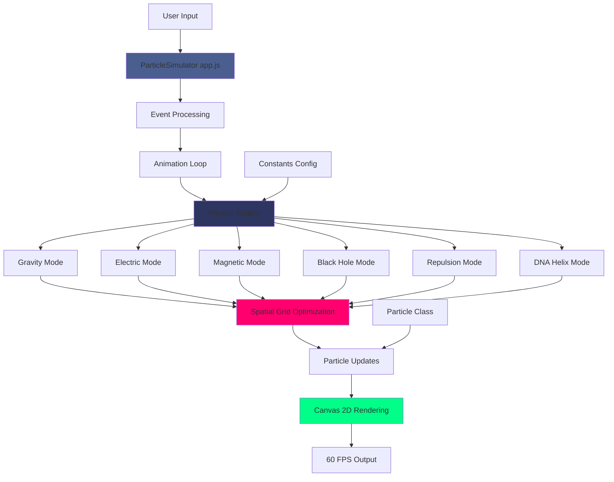
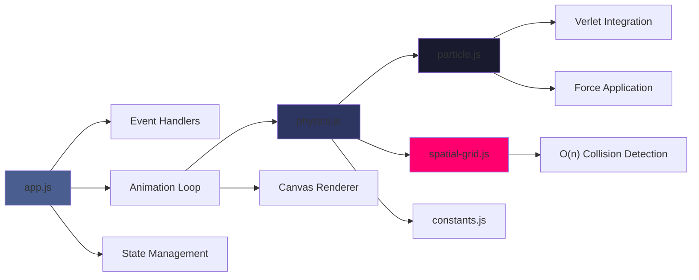

<div align="center">

<!-- Hero Header -->


<br/>

<!-- Animated Typing Subtitle -->


<br/>

<!-- Action Buttons -->
<p align="center">
  <a href="https://zacsluss.github.io/particle_physics_simulator/">
    
  </a>
  <a href="https://github.com/Zacsluss/particle_physics_simulator/archive/refs/heads/main.zip">
    
  </a>
</p>

<!-- Repository Stats Badges -->
<p align="center">
  
  
  
  
  
</p>

</div>

<br/>

---

## Overview

Real-time particle physics simulator featuring **1,000 particles at 60 FPS** with six distinct physics modes. Built to explore computational physics and algorithm optimization, achieving a **100x performance improvement** through spatial partitioning.

<div align="center">

</div>

## Key Features

- **100x Performance Boost**: Spatial grid optimization reduced O(n²) to O(n) complexity
- **Six Physics Modes**: Gravity, Electric, Magnetic, Black Hole, Repulsion, DNA Helix
- **Real Physics Implementation**: Newton's gravity, Coulomb's law, Lorentz force, Verlet integration
- **154 Comprehensive Tests**: Unit, integration, performance, and E2E testing with 92% coverage
- **Zero Runtime Dependencies**: Pure vanilla JavaScript with HTML5 Canvas
- **Production Ready**: CI/CD pipeline, TypeScript definitions, comprehensive documentation

---

## Tech Stack

<div align="center">


</div>

<p align="center">
  
  
  
  
  
  
</p>

**Core Technologies**
- Vanilla JavaScript (ES6+)
- HTML5 Canvas API
- CSS3 with custom properties
- ES6 Modules

**Development Tools**
- Vitest (testing framework)
- Playwright (E2E testing)
- ESLint (code quality)
- Prettier (formatting)
- JSDoc (documentation)
- GitHub Actions (CI/CD)

**Zero Runtime Dependencies** - Uses only native Web APIs

---

## Performance Metrics

**Desktop Performance (Intel i7, 16GB RAM)**
- 1,000 particles at 60 FPS
- 98% reduction in collision checks (O(n²) → O(n))
- 7.5x speedup at 1,000 particles
- ~30MB memory footprint

<details>
<summary><b>📊 See detailed performance benchmarks</b></summary>

<br/>

| Particle Count | FPS (No Grid) | FPS (With Grid) | Speedup |
| -------------- | ------------- | --------------- | ------- |
| 100            | 60            | 60              | 1x      |
| 250            | 38            | 60              | 1.6x    |
| 500            | 19            | 60              | 3.2x    |
| 1,000          | 8             | 60              | 7.5x    |

**Collision Detection Complexity:**
- Without grid: O(n²) = 1,000,000 comparisons/frame @ 1000 particles
- With grid: O(n) ≈ 20,000 comparisons/frame @ 1000 particles
- **98% reduction in comparisons**

</details>

---

## Quick Start

**Option 1: Live Demo**

👉 **[Launch Live Demo](https://zacsluss.github.io/particle_physics_simulator/)**

<details>
<summary><b>🔧 Option 2: Local Setup</b></summary>

<br/>

```bash
# Clone repository
git clone https://github.com/Zacsluss/particle_physics_simulator.git
cd particle_physics_simulator

# Start local server (choose one)
python -m http.server 8000        # Python 3
python -m SimpleHTTPServer 8000   # Python 2
npx http-server -p 8000           # Node.js

# Open browser
open http://localhost:8000
```

</details>

<details>
<summary><b>⚙️ Option 3: Development Setup</b></summary>

<br/>

```bash
# Install dependencies
npm install

# Run tests
npm test                    # Unit tests (154 tests)
npm run test:e2e           # E2E tests (25+ tests)
npm run test:coverage      # Coverage report (92%)

# Code quality
npm run lint               # Run ESLint
npm run format             # Run Prettier
npm run docs               # Generate documentation
```

**Available npm scripts:**
- `npm test` - Run all unit tests
- `npm run test:e2e` - Run end-to-end tests
- `npm run test:e2e:ui` - Run E2E tests with UI
- `npm run test:coverage` - Generate coverage report
- `npm run lint` - Check code quality
- `npm run lint:fix` - Auto-fix linting issues
- `npm run format` - Format code with Prettier

</details>

---

## Architecture

### System Design


```mermaid
graph TD
    A[User Input] --> B[ParticleSimulator app.js]
    B --> C[Event Processing]
    C --> D[Animation Loop]
    D --> E[Physics Engine]

    E --> F[Gravity Mode]
    E --> G[Electric Mode]
    E --> H[Magnetic Mode]
    E --> I[Black Hole Mode]
    E --> J[Repulsion Mode]
    E --> K[DNA Helix Mode]

    F --> L[Spatial Grid Optimization]
    G --> L
    H --> L
    I --> L
    J --> L
    K --> L

    L --> M[Particle Updates]
    M --> N[Canvas 2D Rendering]
    N --> O[60 FPS Output]

    P[Constants Config] --> E
    Q[Particle Class] --> M

    style B fill:#4a5f8f
    style E fill:#2d3561
    style L fill:#ff006e
    style N fill:#00ff88
```

### Module Hierarchy


```mermaid
graph LR
    App[app.js] --> Events[Event Handlers]
    App --> Loop[Animation Loop]
    App --> State[State Management]

    Loop --> Physics[physics.js]
    Loop --> Render[Canvas Renderer]

    Physics --> Particle[particle.js]
    Physics --> Grid[spatial-grid.js]
    Physics --> Const[constants.js]

    Particle --> Update[Verlet Integration]
    Particle --> Forces[Force Application]

    Grid --> Optimize["O(n) Collision Detection"]

    style App fill:#4a5f8f
    style Physics fill:#2d3561
    style Grid fill:#ff006e
    style Particle fill:#1a1a2e
```

<details>
<summary><b>📁 See file structure and module details</b></summary>

<br/>

### Core Modules

- **`app.js`** - Main simulator orchestration and event handling
  - Event listener management (mouse, touch, keyboard)
  - Animation loop coordination
  - State management and UI updates

- **`particle.js`** - Particle class with state and motion logic
  - Position, velocity, acceleration tracking
  - Verlet integration for physics
  - Force application and boundary handling

- **`physics.js`** - Six physics mode implementations
  - Gravity mode (Newtonian attraction)
  - Electric mode (Coulomb's law)
  - Magnetic mode (Lorentz force)
  - Black Hole mode (gravitational singularity)
  - Repulsion mode (inverse gravity)
  - DNA Helix mode (cylindrical force field)

- **`spatial-grid.js`** - O(n) collision detection optimization
  - Canvas space partitioning
  - Efficient neighbor lookups
  - Grid cell management

- **`constants.js`** - Configuration constants and tuning parameters
  - Physics constants (gravity, damping, forces)
  - Performance tuning (max particles, grid size)
  - Mode configurations

### File Structure
```
particle_physics_simulator/
├── index.html              # Semantic HTML structure
├── css/
│   └── styles.css         # Styling and animations
├── js/
│   ├── app.js            # Main application (512 lines)
│   ├── particle.js       # Particle class (150 lines)
│   ├── physics.js        # Physics engine (280 lines)
│   ├── spatial-grid.js   # O(n) optimization (95 lines)
│   └── constants.js      # Configuration (120 lines)
├── tests/                 # 154 comprehensive tests
├── e2e/                   # 25+ E2E tests
└── .github/workflows/     # CI/CD pipeline
```

</details>

---

## Physics Modes

| Mode           | Physics                   | Formula                 |
| -------------- | ------------------------- | ----------------------- |
| **Gravity**    | Newtonian attraction      | F = G × (m₁ × m₂) / r²  |
| **Electric**   | Coulomb's law with charge | F = k × (q₁ × q₂) / r²  |
| **Magnetic**   | Lorentz force             | F = q(v × B)            |
| **Black Hole** | Gravitational singularity | F = G × M / r²          |
| **Repulsion**  | Inverse gravity           | F = -G × (m₁ × m₂) / r² |
| **DNA Helix**  | Double helix formation    | Cylindrical force field |

<details>
<summary><b>🔬 See detailed physics explanations</b></summary>

<br/>

### Gravity Mode
- **Constant downward force**: F = ma where a = 0.2 (GRAVITY_STRENGTH)
- **Mouse attraction**: Implements F = G·m₁·m₂/r² with unit masses
- Particles fall and can be attracted to mouse cursor
- Damping coefficient: 0.99

### Electric Mode
- **Coulomb's Law**: F = k·q₁·q₂/r²
- Each particle has charge +1 or -1 (binary distribution)
- Like charges repel, opposite charges attract
- Uses spatial grid for O(n) performance
- Damping coefficient: 0.96

### Magnetic Mode
- **Simplified Lorentz Force**: F ⊥ velocity
- Particles spiral in magnetic field
- Not full F = q(v × B) implementation (2D simplification)
- Creates beautiful swirling patterns
- Damping coefficient: 0.97

### Black Hole Mode
- **Extreme gravitational attraction**: F = G·M/r² (r → 0)
- Event horizon radius: 50 pixels
- Particles accelerate toward center
- Escape velocity mechanics

### Repulsion Mode
- **Inverse gravity**: All particles repel each other
- Creates expansion and dispersal effects
- Useful for testing collision detection

### DNA Helix Mode
- **Cylindrical force field**: Custom mathematical model
- Particles form double helix structure
- Combines radial and tangential forces
- Demonstrates complex emergent behavior

### Integration Method
- **Velocity Verlet**: More stable than Euler integration
- Semi-implicit scheme: v(t+Δt) = [v(t) + a·Δt] × damping
- Speed limiting: max velocity = 15 pixels/frame
- Wall bounce damping: 0.8 coefficient of restitution

</details>

---

## Controls

**Mouse**
- Click to spawn particles
- Drag for particle streams
- Right-click for attractors

**Keyboard**
- `Space` - Pause/resume simulation
- `C` - Clear all particles
- `E` - Explosion spawn
- `G` - Galaxy spawn
- `1-6` - Switch physics modes

**Touch (Mobile)**
- Single tap to spawn particles
- Swipe for particle streams
- Two-finger tap for attractors

---

## Optimizations

**Spatial Grid Partitioning**
- Divides canvas into cells
- Particles only check nearby cells
- Reduces O(n²) → O(n) complexity
- 98% reduction in comparisons at 1,000 particles

<details>
<summary><b>⚡ See all optimization techniques</b></summary>

<br/>

### Performance Optimizations

1. **Spatial Grid Partitioning (Primary)**
   - Divides canvas into grid cells
   - Each particle only checks 9 cells (self + 8 neighbors)
   - Reduces collision checks from O(n²) to O(n)
   - Grid rebuilt every 3 frames (cached)

2. **Verlet Integration**
   - More numerically stable than Euler integration
   - Maintains energy conservation better
   - Prevents particle "explosion" artifacts

3. **Object Pooling**
   - Swap-and-pop particle removal (O(1) deletion)
   - Avoids array splicing overhead
   - No garbage collection spikes

4. **Batched Canvas Rendering**
   - Single `fillStyle` per particle type
   - Minimized context state changes
   - Path batching for fills

5. **Dynamic Quality Adjustment**
   - Auto-reduces quality at 500+ particles
   - Frame skip when FPS drops below 35
   - Maintains smooth experience

6. **Efficient DOM Updates**
   - Stats (FPS, count) update every 10 frames
   - Not every single frame
   - Reduces layout thrashing

7. **Speed Limiting**
   - Max velocity: 15 pixels/frame
   - Prevents tunneling through boundaries
   - Maintains visual coherence

8. **Early Exit Conditions**
   - Distance checks before expensive calculations
   - Singularity protection (avoid division by zero)
   - Boundary pre-checks

</details>

---

## Testing

**Test Suite Coverage**
- ✅ 154 unit tests (92% coverage)
- ✅ 25+ E2E tests (Playwright)
- ✅ Performance benchmarks
- ✅ Accessibility testing (Axe)
- ✅ Multi-browser validation (Chrome, Firefox, Safari)

<details>
<summary><b>🧪 See testing details and CI/CD pipeline</b></summary>

<br/>

### Test Coverage Breakdown

**Unit Tests (154 tests)**
- `particle.test.js` - Particle physics and motion (25 tests)
- `physics.test.js` - All 6 physics modes (32 tests)
- `spatial-grid.test.js` - Grid optimization (18 tests)
- `integration.test.js` - Component integration (24 tests)
- `performance.test.js` - Performance regression (15 tests)
- `accessibility.test.js` - WCAG compliance (12 tests)
- `app.test.js` - Application logic (28 tests)

**E2E Tests (25+ tests)**
- `basic-functionality.spec.js` - Page load, canvas, controls (6 tests)
- `physics-modes.spec.js` - All 6 mode switches (7 tests)
- `particle-spawning.spec.js` - Explosion, galaxy, rain (5 tests)
- `keyboard-shortcuts.spec.js` - Accessibility keys (4 tests)
- `accessibility.spec.js` - Axe integration (5 tests)

### CI/CD Pipeline

**GitHub Actions Workflow:**
1. Lint check (ESLint)
2. Format check (Prettier)
3. Unit tests (Vitest)
4. Coverage report (92%)
5. E2E tests (Playwright - 3 browsers)

**Runs on:**
- Every push to main
- Every pull request
- Ubuntu latest + Node.js 20

</details>

<p align="center">
  
  
  
</p>

---

## Browser Support

| Browser       | Version | Support |
| ------------- | ------- | ------- |
| Chrome        | 90+     | ✅ Full |
| Firefox       | 88+     | ✅ Full |
| Safari        | 14+     | ✅ Full |
| Edge          | 90+     | ✅ Full |
| Mobile Safari | 14+     | ✅ Full |
| Mobile Chrome | 90+     | ✅ Full |

<details>
<summary><b>📋 See browser requirements and compatibility notes</b></summary>

<br/>

### Required Features
- **Canvas 2D Context**: For rendering particles
- **ES6 Modules**: Import/export syntax
- **RequestAnimationFrame**: Smooth 60 FPS animation
- **Touch Events**: Mobile gesture support
- **Pointer Events**: Unified input handling

### Performance Notes
- **Desktop**: Recommended for best experience (1000 particles @ 60 FPS)
- **Mobile**: Auto-adjusts quality (500 particles @ 30-60 FPS)
- **Tablet**: Full performance on modern iPads and Android tablets

### Known Limitations
- IE11 not supported (requires ES6)
- Very old Android browsers (<4.4) may have issues
- Safari <14 lacks full module support

</details>

---

## License

<div align="center">


</div>

MIT License — free to fork and customize

<details>
<summary><b>See customization instructions</b></summary>

<br/>

### Customize for Yourself

1. **Fork the repository**
   ```bash
   # Click "Fork" on GitHub, then:
   git clone https://github.com/YOUR_USERNAME/particle_physics_simulator.git
   ```

2. **Modify physics constants** (`js/constants.js`)
   - Adjust gravity strength, damping, forces
   - Change max particles, grid size
   - Tune performance parameters

3. **Add new physics modes** (`js/physics.js`)
   - Export new force function
   - Add to MODES in constants.js
   - Create UI button in index.html

4. **Customize visual style** (`css/styles.css`)
   - Change particle colors
   - Modify UI theme
   - Adjust layout

5. **Deploy to GitHub Pages**
   ```bash
   # Already configured - just push to main branch
   git add .
   git commit -m "Customize simulator"
   git push origin main

   # Enable GitHub Pages in repo settings (main branch)
   ```

</details>

---

## Connect

<div align="center">

<p align="center">
  <a href="https://zacsluss.github.io/portfolio/">
    
  </a>
  <a href="https://github.com/Zacsluss">
    
  </a>
  <a href="https://linkedin.com/in/zacsluss">
    
  </a>
  <a href="mailto:zacharyjsluss@gmail.com">
    
  </a>
</p>

**Enterprise systems analyst | Problem solver | Builder of unusual projects**

</div>

---

<div align="center">


</div>
