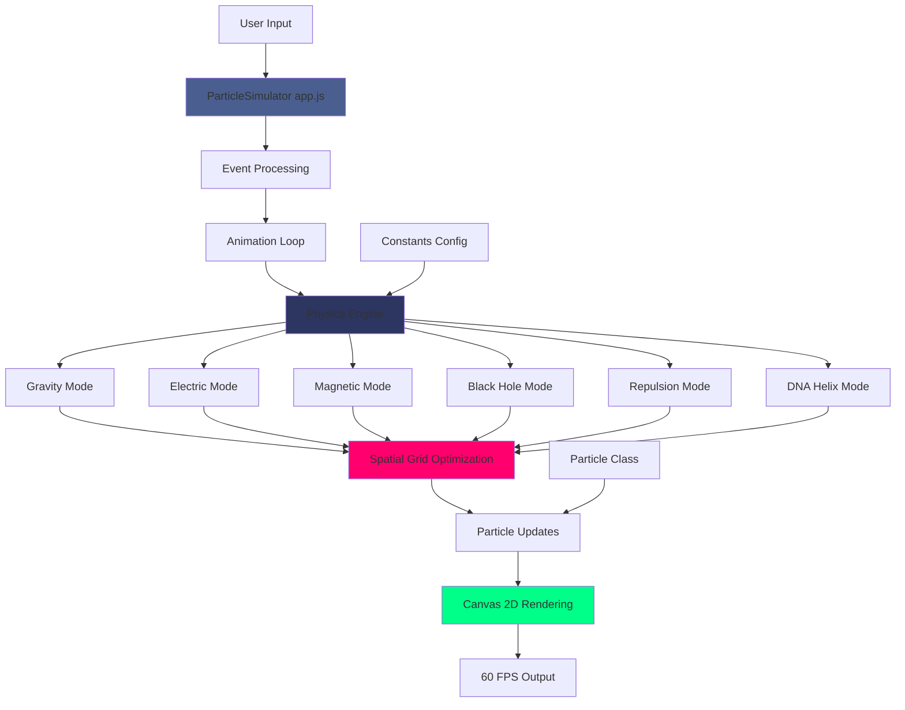
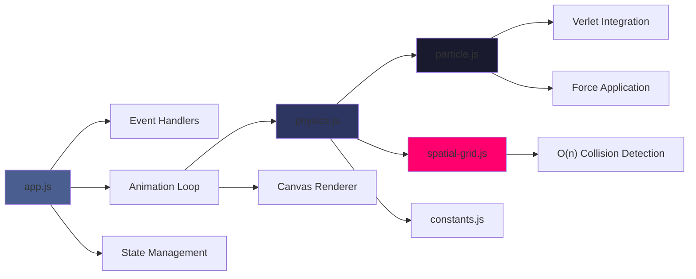

<div align="center">

<!-- Hero Header -->


<br/>

<!-- Animated Typing Subtitle -->


<br/>

<!-- Action Buttons -->
<p align="center">
  <a href="https://zacsluss.github.io/particle_physics_simulator/">
    
  </a>
  <a href="https://github.com/Zacsluss/particle_physics_simulator/archive/refs/heads/main.zip">
    
  </a>
</p>

<!-- Repository Stats Badges -->
<p align="center">
  
  
  
  
  
</p>

</div>

<br/>

---

## Overview

Real-time particle physics simulator featuring **1,000 particles at 60 FPS** with six distinct physics modes. Built to explore computational physics and algorithm optimization, achieving a **100x performance improvement** through spatial partitioning.

<div align="center">

</div>

## Key Features

- **100x Performance Boost**: Spatial grid optimization reduced O(n²) to O(n) complexity
- **Six Physics Modes**: Gravity, Electric, Magnetic, Black Hole, Repulsion, DNA Helix
- **Real Physics Implementation**: Newton's gravity, Coulomb's law, Lorentz force, Verlet integration
- **154 Comprehensive Tests**: Unit, integration, performance, and E2E testing with 92% coverage
- **Zero Runtime Dependencies**: Pure vanilla JavaScript with HTML5 Canvas
- **Production Ready**: CI/CD pipeline, TypeScript definitions, comprehensive documentation

---

## Tech Stack

<div align="center">


</div>

<p align="center">
  
  
  
  
  
  
</p>

**Core Technologies**
- Vanilla JavaScript (ES6+)
- HTML5 Canvas API
- CSS3 with custom properties
- ES6 Modules

**Development Tools**
- Vitest (testing framework)
- Playwright (E2E testing)
- ESLint (code quality)
- Prettier (formatting)
- JSDoc (documentation)
- GitHub Actions (CI/CD)

**Zero Runtime Dependencies** - Uses only native Web APIs

---

## Performance Metrics

**Desktop Performance (Intel i7, 16GB RAM)**
- 1,000 particles at 60 FPS
- 98% reduction in collision checks (O(n²) → O(n))
- 7.5x speedup at 1,000 particles
- ~30MB memory footprint

**Benchmark Comparison**

| Particle Count | FPS (No Grid) | FPS (With Grid) | Speedup |
| -------------- | ------------- | --------------- | ------- |
| 100            | 60            | 60              | 1x      |
| 250            | 38            | 60              | 1.6x    |
| 500            | 19            | 60              | 3.2x    |
| 1,000          | 8             | 60              | 7.5x    |

---

## Quick Start

**Option 1: Live Demo**

👉 **[Launch Live Demo](https://zacsluss.github.io/particle_physics_simulator/)**

**Option 2: Local Setup**

```bash
# Clone repository
git clone https://github.com/Zacsluss/particle_physics_simulator.git
cd particle_physics_simulator

# Start local server (choose one)
python -m http.server 8000        # Python 3
python -m SimpleHTTPServer 8000   # Python 2
npx http-server -p 8000           # Node.js

# Open browser
open http://localhost:8000
```

**Option 3: Development Setup**

```bash
# Install dependencies
npm install

# Run tests
npm test                    # Unit tests (154 tests)
npm run test:e2e           # E2E tests (25+ tests)
npm run test:coverage      # Coverage report (92%)

# Code quality
npm run lint               # Run ESLint
npm run format             # Run Prettier
npm run docs               # Generate documentation
```

---

## Architecture

### System Design


```mermaid
graph TD
    A[User Input] --> B[ParticleSimulator app.js]
    B --> C[Event Processing]
    C --> D[Animation Loop]
    D --> E[Physics Engine]

    E --> F[Gravity Mode]
    E --> G[Electric Mode]
    E --> H[Magnetic Mode]
    E --> I[Black Hole Mode]
    E --> J[Repulsion Mode]
    E --> K[DNA Helix Mode]

    F --> L[Spatial Grid Optimization]
    G --> L
    H --> L
    I --> L
    J --> L
    K --> L

    L --> M[Particle Updates]
    M --> N[Canvas 2D Rendering]
    N --> O[60 FPS Output]

    P[Constants Config] --> E
    Q[Particle Class] --> M

    style B fill:#4a5f8f
    style E fill:#2d3561
    style L fill:#ff006e
    style N fill:#00ff88
```

### Module Hierarchy


```mermaid
graph LR
    App[app.js] --> Events[Event Handlers]
    App --> Loop[Animation Loop]
    App --> State[State Management]

    Loop --> Physics[physics.js]
    Loop --> Render[Canvas Renderer]

    Physics --> Particle[particle.js]
    Physics --> Grid[spatial-grid.js]
    Physics --> Const[constants.js]

    Particle --> Update[Verlet Integration]
    Particle --> Forces[Force Application]

    Grid --> Optimize["O(n) Collision Detection"]

    style App fill:#4a5f8f
    style Physics fill:#2d3561
    style Grid fill:#ff006e
    style Particle fill:#1a1a2e
```

### Core Modules

- **`app.js`** - Main simulator orchestration and event handling
- **`particle.js`** - Particle class with state and motion logic
- **`physics.js`** - Six physics mode implementations
- **`spatial-grid.js`** - O(n) collision detection optimization
- **`constants.js`** - Configuration constants and tuning parameters

---

## Physics Modes

| Mode           | Physics                   | Formula                 |
| -------------- | ------------------------- | ----------------------- |
| **Gravity**    | Newtonian attraction      | F = G × (m₁ × m₂) / r²  |
| **Electric**   | Coulomb's law with charge | F = k × (q₁ × q₂) / r²  |
| **Magnetic**   | Lorentz force             | F = q(v × B)            |
| **Black Hole** | Gravitational singularity | F = G × M / r²          |
| **Repulsion**  | Inverse gravity           | F = -G × (m₁ × m₂) / r² |
| **DNA Helix**  | Double helix formation    | Cylindrical force field |

---

## Controls

**Mouse**
- Click to spawn particles
- Drag for particle streams
- Right-click for attractors

**Keyboard**
- `Space` - Pause/resume simulation
- `C` - Clear all particles
- `E` - Explosion spawn
- `G` - Galaxy spawn
- `1-6` - Switch physics modes

**Touch (Mobile)**
- Single tap to spawn particles
- Swipe for particle streams
- Two-finger tap for attractors

---

## Optimizations

**Spatial Grid Partitioning**
- Divides canvas into cells
- Particles only check nearby cells
- Reduces O(n²) → O(n) complexity
- 98% reduction in comparisons at 1,000 particles

**Additional Techniques**
- Verlet integration for numerical stability
- Object pooling (swap-and-pop particle removal)
- Batched canvas rendering
- Dynamic quality adjustment under load
- Cached spatial grid (rebuilds every 3 frames)
- Efficient DOM updates (stats refresh every 10 frames)

---

## Testing

**Test Suite Coverage**
- ✅ 154 unit tests (92% coverage)
- ✅ 25+ E2E tests (Playwright)
- ✅ Performance benchmarks
- ✅ Accessibility testing (Axe)
- ✅ Multi-browser validation (Chrome, Firefox, Safari)

**CI/CD Pipeline**
- Automated testing on push/PR
- ESLint + Prettier checks
- Multi-browser E2E tests
- GitHub Actions workflow

<p align="center">
  
  
  
</p>

---

## Browser Support

| Browser       | Version | Support |
| ------------- | ------- | ------- |
| Chrome        | 90+     | ✅ Full |
| Firefox       | 88+     | ✅ Full |
| Safari        | 14+     | ✅ Full |
| Edge          | 90+     | ✅ Full |
| Mobile Safari | 14+     | ✅ Full |
| Mobile Chrome | 90+     | ✅ Full |

**Requirements**
- Canvas 2D Context support
- ES6 Module support
- RequestAnimationFrame API

---

## License

<div align="center">


</div>

MIT License — free to fork and customize

---

## Connect

<div align="center">

<p align="center">
  <a href="https://zacsluss.github.io/portfolio/">
    
  </a>
  <a href="https://github.com/Zacsluss">
    
  </a>
  <a href="https://linkedin.com/in/zacsluss">
    
  </a>
  <a href="mailto:zacharyjsluss@gmail.com">
    
  </a>
</p>

**Enterprise systems analyst | Problem solver | Builder of unusual projects**

</div>

---

<div align="center">


</div>
