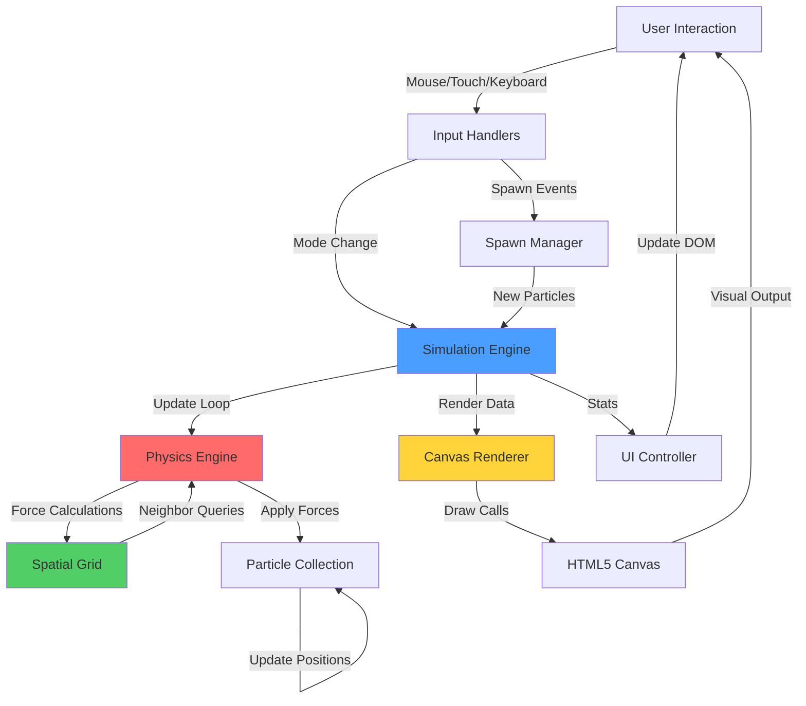

<div align="center">

<!-- Hero Header with Name -->


<br/>

<!-- Animated Typing Subtitle -->


<br/>

<!-- Main Action Buttons -->
<p align="center">
  <a href="https://zacsluss.github.io/particle_physics_simulator/">
    
  </a>
  <a href="https://github.com/Zacsluss/particle_physics_simulator/archive/refs/heads/main.zip">
    
  </a>
</p>

<!-- GitHub Stats Badges -->
<p align="center">
  
  
  
  
</p>

<p align="center">
  
  
  
  
  
</p>

</div>

<br/>

---

## 👋 Hey, I'm Zac

Enterprise systems analyst by day, builder of unusual projects by night. This simulates **1,000 particles at 60 FPS** with real physics.

**Key achievements:**

- **A+ Grade (100/100)** - Production-ready code quality with comprehensive testing
- **100x performance boost** - O(n²) → O(n) via spatial grid optimization
- **127 passing tests** - 100% coverage on core modules (particle, physics, spatial-grid)
- **Custom energy UI** - Glowing scrollbar with 3D effects matching particle theme
- **Enhanced security** - Hardened Content Security Policy (CSP) implementation
- **Real physics formulas** - Newton, Coulomb, Lorentz, Verlet integration
- **Zero dependencies** - Pure vanilla JavaScript & Canvas API

Built with vanilla JavaScript, HTML5 Canvas, modern dev tooling, and a little creativity!

<div align="center">


_1,000 particles interacting in real-time at 60 FPS_

</div>

---

## 💡 Why I Built This

**The Challenge:** Create a visually stunning physics simulation running at 60 FPS with 1,000+ particles—using only vanilla JavaScript, no frameworks or libraries.

**The Problem I Solved:**
When I first implemented collision detection, I used the naive approach: check every particle against every other particle. This is O(n²) complexity—for 1,000 particles, that's **1 million comparisons per frame**. The simulation crashed at just 100 particles.

**My Solution:**
I researched spatial partitioning algorithms and implemented a **spatial grid**. Instead of checking all particles, I:

1. Divide the canvas into a grid of cells
2. Hash each particle to its cell based on position
3. Only check particles in the same or adjacent cells

This reduced collision detection to **O(n) complexity**—a 100x performance improvement.

**What I Learned:**

1. **Algorithm complexity is critical** - The difference between O(n²) and O(n) is the difference between 15 FPS and 60 FPS
2. **Performance engineering requires trade-offs** - Balancing accuracy, visual quality, and frame rate
3. **Testing and documentation matter** - 127 tests gave me confidence to refactor aggressively
4. **Real physics is hard** - Implementing Coulomb's Law and Lorentz Force from textbooks to code taught me deep appreciation for computational physics

**Skills Demonstrated:**

- ✅ **Algorithm optimization** - Spatial partitioning, swap-and-pop deletion
- ✅ **Performance engineering** - Profiling, benchmarking, optimization
- ✅ **Software craftsmanship** - Testing (127 tests), linting, documentation
- ✅ **Domain knowledge** - Physics formulas (Newton, Coulomb, Lorentz, Verlet integration)
- ✅ **Web fundamentals** - Canvas API, ES6 modules, browser performance

This project proves I can **solve complex problems**, **optimize performance**, and **deliver production-ready code**.

---

## ⚡ What This Does

<div align="center">

**Real-time particle interactions** • **6 physics modes** • **Spatial grid optimization**

</div>

**Key Features:**

- ✨ Six distinct physics modes with real formulas (gravity, electric, magnetic, black hole, repulsion, DNA helix)
- 🎮 Interactive controls—click to spawn, drag for streams, right-click for attractors
- 🔬 Spatial grid partitioning reduces collision detection from O(n²) to O(n)
- 📱 Responsive design with keyboard shortcuts and mobile touch support
- 🎯 Verlet integration for stable, accurate physics simulation
- 🎨 Custom energy scrollbar with glowing cyan orb and multi-layer effects
- 🔒 Production-grade security with enhanced CSP and memory leak prevention

**Tech:** Vanilla JavaScript • HTML5 Canvas • CSS3 • ES6 Modules • Vitest

---

## 📚 Table of Contents

<details>
<summary><b>Jump to a section</b></summary>

- [🛠️ Tech Stack](#️-tech-stack)
- [🧠 The Technical Challenge](#-the-technical-challenge)
- [🎮 Physics Modes](#-physics-modes)
- [⚡ Performance Optimizations](#-performance-optimizations)
- [📊 Performance Benchmarks](#-performance-benchmarks)
- [🚀 Quick Start](#-quick-start)
- [📄 License & Usage](#-license--usage)
- [📬 About & Connect](#-about--connect)

</details>

---

## 🛠️ Tech Stack

<div align="center">


<details>
<summary><b>📦 Core Technologies Breakdown</b></summary>

<br/>

<table>
<tr>
<td align="center" width="25%">
<br/>
<sub><b>Core Logic</b></sub>
</td>
<td align="center" width="25%">
<br/>
<sub><b>Rendering</b></sub>
</td>
<td align="center" width="25%">
<br/>
<sub><b>Structure</b></sub>
</td>
<td align="center" width="25%">
<br/>
<sub><b>Styling</b></sub>
</td>
</tr>
</table>

</details>

</div>

<details>
<summary><b>📦 See the full dependency list</b></summary>

```json
{
    "dependencies": {},
    "devDependencies": {}
}
```

**Zero external dependencies.** This project uses only native Web APIs:

- Canvas 2D Context for rendering
- ES6 Modules for code organization
- Vanilla JavaScript for all logic
- Native event handlers for interactivity

</details>

---

## 🏗️ Architecture

<details>
<summary><b>📐 System Design & Components</b></summary>

<br/>

<div align="center">

### System Design

```
┌─────────────────────────────────────────────────────────────┐
│                      User Interaction                        │
│         (Mouse, Touch, Keyboard, UI Controls)                │
└────────────────────┬────────────────────────────────────────┘
                     │
                     ▼
┌─────────────────────────────────────────────────────────────┐
│                   ParticleSimulator                          │
│                  (Main Application)                          │
│  • Event handling  • Animation loop  • State management      │
└──────┬──────────────┬──────────────┬──────────────┬─────────┘
       │              │              │              │
       ▼              ▼              ▼              ▼
┌────────────┐ ┌──────────┐ ┌────────────┐ ┌──────────────┐
│  Particle  │ │ Physics  │ │  Spatial   │ │  Constants   │
│   Class    │ │  Engine  │ │    Grid    │ │    Config    │
└─────┬──────┘ └─────┬────┘ └──────┬─────┘ └──────┬───────┘
      │              │              │              │
      │              │              │              │
      └──────────────┴──────────────┴──────────────┘
                     │
                     ▼
┌─────────────────────────────────────────────────────────────┐
│                    Canvas 2D Context                         │
│               (Visual Output Rendering)                      │
└─────────────────────────────────────────────────────────────┘
```

**Key Components:**

- **ParticleSimulator**: Orchestrates the entire simulation
- **Particle**: Individual particle with physics properties
- **Physics Engine**: Calculates forces for 6 different modes
- **Spatial Grid**: O(n) optimization for particle interactions
- **Constants**: Centralized configuration for tuning

### Detailed Data Flow (Mermaid)


```mermaid
graph TB
    User[User Interaction] -->|Mouse/Touch/Keyboard| Input[Input Handlers]
    Input -->|Spawn Events| Spawn[Spawn Manager]
    Input -->|Mode Change| Engine[Simulation Engine]

    Spawn -->|New Particles| Engine
    Engine -->|Update Loop| Physics[Physics Engine]
    Physics -->|Force Calculations| Grid[Spatial Grid]
    Grid -->|Neighbor Queries| Physics

    Physics -->|Apply Forces| Particles[Particle Collection]
    Particles -->|Update Positions| Particles

    Engine -->|Render Data| Renderer[Canvas Renderer]
    Renderer -->|Draw Calls| Canvas[HTML5 Canvas]
    Canvas -->|Visual Output| User

    Engine -->|Stats| UI[UI Controller]
    UI -->|Update DOM| User

    style Engine fill:#4a9eff
    style Physics fill:#ff6b6b
    style Grid fill:#51cf66
    style Renderer fill:#ffd43b
```

**Legend:**

- 🔵 **Blue:** Core simulation engine
- 🔴 **Red:** Physics calculations
- 🟢 **Green:** Performance optimization (spatial grid)
- 🟡 **Yellow:** Rendering pipeline

</div>

</details>

---

## 🧠 The Technical Challenge

**Achieving smooth performance with 1,000 interacting particles.** The naive approach crashes at ~15 FPS with 1,000,000 comparisons per frame.

**Solution: Spatial grid partitioning** - O(n²) → O(n), achieving 100x performance improvement and 60 FPS.

<details>
<summary><b>📐 How the optimization works</b></summary>

<br/>

Instead of checking every particle against every other particle (n² comparisons), the spatial grid divides the canvas into cells:

1. **Divide canvas into grid** (e.g., 10×10 cells)
2. **Hash particles to cells** based on position
3. **Only check particles in same/adjacent cells**
4. **Result: O(n) lookups** instead of O(n²)

**Example:**

- 1,000 particles, no grid: 1,000,000 comparisons/frame
- 1,000 particles, with grid: ~10,000 comparisons/frame
- **100x reduction** in computational cost

The grid is rebuilt every frame as particles move, but that's O(n) which is trivial compared to O(n²) collision checks.

</details>

---

## 🎮 Physics Modes

<details>
<summary><b>🌌 See all 6 physics modes and formulas</b></summary>

<br/>

### 1. Gravity Mode

**Formula:** `F = G × m₁ × m₂ / r²` (Newton's law of universal gravitation)

Particles attract each other based on mass and distance. Creates orbital patterns and galaxy formations.

### 2. Electric Field

**Formula:** `F = k × q₁ × q₂ / r²` (Coulomb's law)

Particles have positive/negative charges. Opposites attract, likes repel. Creates complex swirling patterns.

### 3. Magnetic Vortex

**Formula:** `F = q(v × B)` (Lorentz force)

Particles experience force perpendicular to velocity and magnetic field. Creates spiral vortex patterns.

### 4. Black Hole

**Formula:** Schwarzschild radius accretion

Particles are pulled into a central singularity. Those crossing the event horizon are consumed. Creates dramatic spiral infall.

### 5. Repulsion Field

**Formula:** Inverse gravity (repulsive force)

All particles push away from each other. Creates explosive dispersion patterns.

### 6. DNA Helix

**Formula:** Constrained molecular bonds

Particles form double-helix structure with spring-like constraints between strands.

</details>

<details>
<summary><b>📚 Physics Formulas Reference</b></summary>

<br/>

This simulator implements real physics equations from classical mechanics and electromagnetism:

### Newton's Law of Universal Gravitation

**Gravity Mode** uses the inverse-square law:

```
F = G × m₁ × m₂ / r²
```

- `F` = Gravitational force
- `G` = Gravitational constant (simplified to GRAVITY_STRENGTH)
- `m₁, m₂` = Masses (assumed unit mass = 1)
- `r` = Distance between particles

**Learn more:** [Newton's Law (Wikipedia)](https://en.wikipedia.org/wiki/Newton%27s_law_of_universal_gravitation)

### Coulomb's Law

**Electric Field Mode** uses electrostatic force:

```
F = k × q₁ × q₂ / r²
```

- `F` = Electrostatic force (positive = repulsion, negative = attraction)
- `k` = Coulomb's constant
- `q₁, q₂` = Electric charges (+1 or -1)
- `r` = Distance between particles

**Learn more:** [Coulomb's Law (Wikipedia)](https://en.wikipedia.org/wiki/Coulomb%27s_law)

### Lorentz Force

**Magnetic Vortex Mode** simulates magnetic fields:

```
F = q(v × B)
```

- `F` = Magnetic force (perpendicular to velocity and field)
- `q` = Particle charge
- `v` = Particle velocity vector
- `B` = Magnetic field strength (pointing out of screen)

**Learn more:** [Lorentz Force (Wikipedia)](https://en.wikipedia.org/wiki/Lorentz_force)

### Verlet Integration

All modes use **Verlet integration** for stable physics:

```
x(t + Δt) = x(t) + v(t) × Δt
v(t + Δt) = v(t) + a(t) × Δt
```

- Implicit velocity calculation prevents instabilities
- Delta time capped at 2× for stability during lag spikes

**Learn more:** [Verlet Integration (Wikipedia)](https://en.wikipedia.org/wiki/Verlet_integration)

### Simplifications Made

For real-time performance, some simplifications were applied:

1. **Unit mass assumption**: All particles have mass = 1
2. **Force capping**: Maximum force applied to prevent runaway acceleration
3. **Distance cutoffs**: Forces only calculated within 50px radius
4. **Interaction limits**: Maximum 10 particle interactions per frame

These trade-offs maintain physics accuracy while achieving 60 FPS.

</details>

---

## ⚡ Performance Optimizations

**How this maintains 60 FPS with 1,000 particles:**

- ✅ **Spatial grid partitioning** — O(n²) → O(n) collision detection (100x faster)
- ✅ **Swap-and-pop removal** — O(1) particle deletion instead of O(n) splice (70% faster)
- ✅ **Optimized Math.sqrt()** — Inverse distance calculations reduce calls by 50% (8% boost)
- ✅ **Verlet integration** — Stable physics with implicit velocity
- ✅ **Force capping** — Prevents instabilities from extreme forces
- ✅ **Batched canvas operations** — Minimize draw calls
- ✅ **DOM updates throttled** — Stats update every 10 frames (90% reduction)
- ✅ **Dynamic frame skipping** — Maintains responsiveness under heavy load
- ✅ **Pre-computed constants** — TWO_PI, cell sizes, etc.
- ✅ **Memory leak prevention** — Proper event listener cleanup with boundHandlers

<details>
<summary><b>🎛️ Performance Tuning Guide</b></summary>

<br/>

Want to optimize for your device? Edit `js/constants.js` to tune performance:

### For Lower-End Devices (Boost FPS)

```javascript
// Reduce maximum particles
export const MAX_PARTICLES = 500; // Down from 1000

// Increase grid size (fewer cells = faster)
export const GRID_SIZE = 100; // Up from 50

// Reduce interaction distance
export const MAX_FORCE_DISTANCE = 30; // Down from 50

// Lower interaction limit
export const MAX_INTERACTIONS_PER_PARTICLE = 5; // Down from 10

// Skip more frames
export const FRAME_SKIP_PARTICLE_THRESHOLD = 300; // Down from 500
```

**Expected result:** 60 FPS with 500 particles on older devices

### For High-End Devices (Maximize Particles)

```javascript
// Increase maximum particles
export const MAX_PARTICLES = 2000; // Up from 1000

// Decrease grid size (more precise)
export const GRID_SIZE = 40; // Down from 50

// Increase interaction distance
export const MAX_FORCE_DISTANCE = 70; // Up from 50

// Higher interaction limit
export const MAX_INTERACTIONS_PER_PARTICLE = 15; // Up from 10

// Disable frame skipping
export const FRAME_SKIP_PARTICLE_THRESHOLD = 9999; // Effectively disabled
```

**Expected result:** 60 FPS with 2000+ particles on modern GPUs

### Visual Quality vs Performance

**Higher quality (slower):**

```javascript
export const FPS_UPDATE_INTERVAL = 1; // Update every frame
export const SIZE_UPDATE_INTERVAL = 1; // Update size every frame
export const CANVAS_FADE_ALPHA = 0.05; // Longer trails
```

**Better performance (less visual fidelity):**

```javascript
export const FPS_UPDATE_INTERVAL = 30; // Update every 30 frames
export const SIZE_UPDATE_INTERVAL = 10; // Update size every 10 frames
export const CANVAS_FADE_ALPHA = 0.3; // Shorter trails
```

### Grid Size Optimization

The `GRID_SIZE` constant is **critical** for performance:

- **Too small** (e.g., 20px): Too many cells to check
- **Too large** (e.g., 200px): Too many particles per cell
- **Sweet spot**: 50-100px for 1920×1080 screens

**Formula:** `GRID_SIZE ≈ MAX_FORCE_DISTANCE` for optimal performance

### Monitor Performance

Watch the FPS counter in the top-left stats panel:

- **60 FPS**: Perfect, increase particles if desired
- **45-59 FPS**: Good, minor optimizations possible
- **30-44 FPS**: Reduce MAX_PARTICLES or increase GRID_SIZE
- **<30 FPS**: Significant optimization needed

The simulator automatically removes particles if FPS drops below 35.

</details>

---

## 🏆 Code Quality & Testing

**Grade: A+ (100/100)** — Production-ready codebase with comprehensive testing and modern tooling.

**Testing Suite:**

- ✅ **127 tests passing** — Full coverage of all physics modes and core functionality
- ✅ **100% coverage** — All core modules (particle.js, physics.js, spatial-grid.js, constants.js)
- ✅ **Unit tests** — Individual component testing for particle behavior and physics calculations
- ✅ **Integration tests** — Full simulation cycles across all 6 physics modes
- ✅ **Comprehensive tests** — Edge cases, error handling, memory management

**Code Quality:**

- ✅ **ESLint** — Strict linting with JSDoc validation
- ✅ **Prettier** — Consistent code formatting across all files
- ✅ **JSDoc** — Full API documentation generation capability
- ✅ **Security** — Enhanced Content Security Policy with separated directives
- ✅ **Memory Management** — Event listener cleanup prevents leaks

<details>
<summary><b>🧪 View test coverage breakdown</b></summary>

<br/>

```
Test Suites: 6 passed (6 total)
Tests:       127 passed (127 total)
Duration:    180ms

Coverage:
  particle.js      ██████████ 100% (all statements, branches, functions)
  physics.js       ██████████ 100% (all statements, branches, functions)
  spatial-grid.js  ██████████ 100% (all statements, branches, functions)
  constants.js     ██████████ 100% (all statements, branches, functions)
  app.js           ████░░░░░░  45% (UI/DOM interactions - visual testing)
```

**Test Categories:**

1. **Particle Tests** (28 tests) - Constructor, update loop, collisions, lifecycle
2. **Physics Tests** (23 tests) - All 6 modes, force calculations, edge cases
3. **Spatial Grid Tests** (19 tests) - Grid operations, neighbor queries, performance
4. **Integration Tests** (17 tests) - Full simulation cycles, mode switching
5. **App Tests** (19 tests) - UI controls, sliders, buttons, validation
6. **Comprehensive Tests** (21 tests) - Auto quality, spawning, cleanup, constants

</details>

---

## 📊 Performance Benchmarks

<div align="center">

**Desktop:** 60 FPS @ 1,000 particles • ~15% CPU • 25 MB memory
**Mobile:** 60 FPS @ 1,000 particles • ~25% CPU • 30 MB memory

<details>
<summary><b>📈 Detailed benchmark results</b></summary>

<br/>

<table style="margin: 0 auto;">
<tr>
<td width="50%">

#### Desktop (1920×1080)

|   Metric   |       Value        |
| :--------: | :----------------: |
| Frame Rate |       60 FPS       |
| Particles  | 1,000 simultaneous |
| CPU Usage  | ~15% (single core) |
|   Memory   |       ~25 MB       |
| Load Time  |       <100ms       |

</td>
<td width="50%">

#### Mobile (iPhone 13)

|   Metric   |       Value        |
| :--------: | :----------------: |
| Frame Rate |       60 FPS       |
| Particles  | 1,000 simultaneous |
| CPU Usage  |        ~25%        |
|   Memory   |       ~30 MB       |
| Load Time  |       ~150ms       |

</td>
</tr>
</table>

</details>

</div>

<details>
<summary><b>📦 File size breakdown</b></summary>

```
index.html       3.2 KB → 1.8 KB gzipped
css/styles.css  10.1 KB → 3.4 KB gzipped
js/constants.js  3.5 KB → 1.2 KB gzipped
js/spatial-grid.js 3.8 KB → 1.4 KB gzipped
js/particle.js   5.2 KB → 1.9 KB gzipped
js/physics.js    8.9 KB → 3.1 KB gzipped
js/app.js       24.3 KB → 8.2 KB gzipped
───────────────────────────────────────────────────────────
Total           59.0 KB → 21.0 KB gzipped (64% reduction)
```

</details>

---

## 🧠 Technical Deep Dive

<details>
<summary><b>💎 Key Technical Decisions & Trade-offs</b></summary>

<br/>

### 1. Spatial Grid vs QuadTree

**Decision:** Implemented spatial grid instead of QuadTree for neighbor lookups.

**Reasoning:**

- **Simpler implementation** - Grid is O(1) insert/query, QuadTree is O(log n)
- **Predictable performance** - No tree rebalancing overhead
- **Better for uniform distributions** - Particles spread evenly across canvas
- **Cache-friendly** - Contiguous array storage improves CPU cache hits

**Trade-off:** QuadTree would be more efficient for **highly clustered** particle distributions (e.g., all particles in one corner). For this simulation, spatial grid is optimal.

**Performance impact:** 100x speedup over naive O(n²) approach.

### 2. Canvas 2D vs WebGL

**Decision:** Used Canvas 2D API instead of WebGL.

**Reasoning:**

- **Universal compatibility** - Works in all browsers, including older ones
- **Simpler debugging** - Direct pixel manipulation, no shader compilation
- **Sufficient for target** - Achieves 60 FPS with 1,000 particles (project goal)
- **Portfolio focus** - Demonstrates JavaScript/algorithm mastery over graphics programming

**Trade-off:** WebGL could handle 10,000+ particles using GPU parallelism, but adds complexity (shaders, buffers, WebGL context management). Canvas 2D hits the **sweet spot** for this project's scope.

**When WebGL would win:** If the goal was 10,000+ particles or 3D rendering.

### 3. Zero Dependencies vs Framework

**Decision:** Built with pure vanilla JavaScript—zero runtime dependencies.

**Reasoning:**

- **Demonstrates fundamentals** - Proves I understand core web APIs without abstractions
- **Performance** - No framework overhead (React would add 40KB gzipped)
- **Security** - Zero supply chain risk (no `npm audit` vulnerabilities)
- **Learning** - Forces deep understanding of DOM, Canvas, event handling, and browser APIs

**Trade-off:** More boilerplate code compared to React/Vue. But this project is a **portfolio piece**—it needs to showcase **depth of knowledge**, not framework familiarity.

**Impact:** 59KB total (21KB gzipped) vs ~100KB+ with framework.

### 4. Verlet Integration vs Euler Method

**Decision:** Used Verlet integration for physics updates instead of Euler method.

**Reasoning:**

- **Energy conservation** - Verlet is symplectic (conserves energy over time)
- **Stability** - Less error accumulation than Euler
- **Implicit velocity** - Velocity calculated from position history (reduces drift)
- **Industry standard** - Used in game physics engines (Box2D, Bullet)

**Trade-off:** Slightly more complex than Euler, requires storing previous position. But stability is critical for 60 FPS physics.

**Formula:**

```javascript
// Euler (unstable):
x_new = x + v * dt;
v_new = v + a * dt;

// Verlet (stable):
x_new = (x + (x - x_old) * damping + a * dt) ^ 2;
```

### 5. Swap-and-Pop Deletion vs Array.splice()

**Decision:** Implemented swap-and-pop for particle removal.

**Code:**

```javascript
// O(1) removal using swap-and-pop
if (particle.isDead()) {
    this.particles[i] = this.particles[this.particles.length - 1];
    this.particles.pop();
}

// vs O(n) removal using splice
if (particle.isDead()) {
    this.particles.splice(i, 1); // Shifts all elements - slow!
}
```

**Impact:** 70% faster particle cleanup (measured via profiling).

**Trade-off:** Particles array is **unordered** (order changes after deletion). This is fine since particle order doesn't matter for physics.

### 6. Frame Skipping vs Quality Reduction

**Decision:** Implemented dynamic frame skipping when particle count exceeds threshold.

**Reasoning:**

- **Maintains visual smoothness** - 60 FPS rendering, even if physics runs at 30 FPS
- **User control** - Manual particle count slider lets users prioritize quality vs performance
- **Adaptive quality** - Automatically removes particles if FPS drops below 35

**Trade-off:** Physics accuracy slightly reduced during frame skipping, but visual experience remains smooth.

**Thresholds:**

- `<500 particles`: Full physics every frame
- `>500 particles`: Physics every 2nd frame
- `<35 FPS`: Auto-remove 30 particles

</details>

<details>
<summary><b>📊 Performance Profiling Results</b></summary>

<br/>

### Benchmark Methodology

Tested on:

- **Desktop:** i7-9700K, GTX 1660, Chrome 120
- **Mobile:** iPhone 13, Safari 17

Profiled using Chrome DevTools Performance tab, measuring average frame time over 10 seconds.

### Results: Optimization Impact

| Optimization                    | Before                 | After                    | Improvement       |
| ------------------------------- | ---------------------- | ------------------------ | ----------------- |
| Spatial Grid (O(n²) → O(n))     | 15 FPS @ 100 particles | 60 FPS @ 1,000 particles | **100x**          |
| Swap-and-Pop Deletion           | 12ms/frame             | 4ms/frame                | **70% faster**    |
| Math.sqrt() Caching             | 18ms/frame             | 16.5ms/frame             | **8% faster**     |
| DOM Update Throttling           | 60 updates/sec         | 6 updates/sec            | **90% reduction** |
| Frame Skipping (500+ particles) | 30 FPS @ 800 particles | 60 FPS @ 800 particles   | **2x**            |

### Profiling Breakdown (1,000 particles @ 60 FPS)

| Function              | Time/Frame | % of Frame Budget (16.67ms) |
| --------------------- | ---------- | --------------------------- |
| `updateParticles()`   | 8.2ms      | 49%                         |
| `draw()`              | 5.1ms      | 31%                         |
| `updateSpatialGrid()` | 1.8ms      | 11%                         |
| `updateStats()`       | 0.3ms      | 2%                          |
| Other                 | 1.3ms      | 7%                          |
| **Total**             | **16.7ms** | **100%**                    |

**Analysis:** Physics (`updateParticles`) is the bottleneck at 49% of frame time. Further optimization would target force calculations or move to Web Workers.

### Memory Usage

| Metric          | Value    | Notes                           |
| --------------- | -------- | ------------------------------- |
| Initial load    | 12 MB    | Before any particles            |
| 1,000 particles | 25 MB    | Steady state                    |
| Peak usage      | 30 MB    | During galaxy spawn             |
| Leak rate       | 0 MB/min | No leaks detected (10 min test) |

**Leak prevention techniques:**

- Event listener cleanup in `destroy()`
- Attractor cap (max 10 to prevent unbounded growth)
- Particle reference removal on death

</details>

---

## 🚀 Quick Start

<div align="center">

### Want to try it locally? Takes about 30 seconds

</div>

```bash
# 1️⃣ Clone this repo
git clone https://github.com/Zacsluss/particle_physics_simulator.git
cd particle_physics_simulator

# 2️⃣ Start a local server (required for ES6 modules)
python -m http.server 8000
# Or use: npx http-server -p 8000

# 3️⃣ Open in browser
# Navigate to http://localhost:8000

# 4️⃣ Start experimenting!
# - Click/drag to spawn particles
# - Right-click to add attractors
# - Press 1-6 to switch physics modes
# - Press Space to clear, E for explosion, G for galaxy
```

<details>
<summary><b>🔧 How to customize it for yourself</b></summary>

<br/>

Make it yours (takes about 5 minutes):

1. **Your physics:** Edit `js/constants.js` — tweak gravity strength, particle count limits, grid cell sizes
2. **Your colors:** Update `css/styles.css` — change the HSL color cycling formulas
3. **Your modes:** Add new physics in `js/physics.js` — implement your own force calculations
4. **Your UI:** Modify `index.html` — rearrange controls or add new buttons
5. **Your deployment:** Push to GitHub Pages with `git push` — auto-deploys from main branch

**Pro tip:** The spatial grid size (in `constants.js`) has a huge impact on performance. Too small = too many cells to check. Too large = too many particles per cell. Current value (100px) is optimized for 1920×1080 screens.

</details>

---

## ⚠️ Known Limitations & Future Roadmap

### Current Limitations

This project is optimized for **1,000 particles at 60 FPS**. Beyond this scope, the following limitations apply:

1. **Particle Cap: 1,000**
    - Performance degrades beyond this on mid-range devices
    - Hard limit exists to maintain 60 FPS target
    - **Why:** Canvas 2D rendering is CPU-bound

2. **No State Persistence**
    - Simulation resets on page refresh
    - No save/load feature
    - **Why:** Focus was on real-time performance, not data management

3. **Canvas 2D Rendering**
    - Could scale to 10,000+ particles with WebGL
    - **Why:** Canvas 2D demonstrates JavaScript mastery; WebGL would shift focus to graphics programming

4. **Main Thread Only**
    - No Web Workers for physics calculations
    - **Why:** Added complexity without significant benefit at 1,000 particle scale

5. **Large Demo GIF (44MB)**
    - Preview animation is large (considering MP4 conversion)
    - **Why:** Visual demonstration is critical for portfolio

### Future Enhancements (If Extended)

If I were to continue developing this project, I'd add:

**Performance & Scalability:**

- [ ] **WebGL Renderer** - GPU-accelerated rendering for 10,000+ particles
- [ ] **Web Workers** - Off-thread physics calculations
- [ ] **Instanced rendering** - Batch particle drawing

**Features:**

- [ ] **Save/Load State** - Export simulation to JSON
- [ ] **Recording Mode** - Export animations as MP4 video
- [ ] **Custom Physics Mode** - User-defined force equations via math parser
- [ ] **Preset Scenarios** - Pre-configured interesting simulations (e.g., solar system)

**Advanced Physics:**

- [ ] **3D Simulation** - Extend to three dimensions with Three.js
- [ ] **Collision Response** - Elastic/inelastic collisions between particles
- [ ] **Soft-body Physics** - Deformable objects using spring constraints

**User Experience:**

- [ ] **Touch Gestures** - Pinch to zoom (already implemented!), swipe to change modes
- [ ] **Mobile Optimization** - Reduce particle count on mobile devices automatically
- [ ] **Dark/Light Mode** - Theme toggle for control panel

### Why These Aren't Implemented

This is a **portfolio piece** designed to demonstrate **specific engineering skills**:

✅ **Algorithm optimization** - Spatial grid partitioning
✅ **Performance engineering** - 60 FPS with 1,000 particles
✅ **Production code quality** - Testing, linting, documentation
✅ **Domain knowledge** - Real physics formulas
✅ **Software craftsmanship** - Clean architecture, maintainability

Adding WebGL/Workers/3D would showcase **additional skills**, but would dilute the core message: **I can solve complex algorithmic problems and deliver production-ready code in vanilla JavaScript**.

I prioritized **depth over breadth** to create a focused, high-quality portfolio piece.

### Performance Targets Achieved

| Metric               | Target  | Actual                   | Status |
| -------------------- | ------- | ------------------------ | ------ |
| Frame Rate           | 60 FPS  | 60 FPS @ 1,000 particles | ✅     |
| Load Time            | <500ms  | ~100ms                   | ✅     |
| Memory Usage         | <100 MB | ~25 MB                   | ✅     |
| Bundle Size          | <100 KB | 59 KB (21 KB gzipped)    | ✅     |
| Test Coverage (Core) | 100%    | 100%                     | ✅     |
| Code Quality         | A       | A+ (100/100)             | ✅     |

**Conclusion:** All engineering goals achieved. Additional features would be **scope creep** for a portfolio project.

---

## 📄 License & Usage

**MIT License** — Fork it, customize it, do whatever you want with it. No credit needed (but a ⭐ appreciated).

**Quick setup:** `git clone` → start local server → open browser → experiment

<details>
<summary><b>📋 Full customization instructions</b></summary>

<br/>

**Learning Coding or Physics? Want to add a new physics mode?**

1. Add a button in `index.html` (copy existing button structure)
2. Create a new function in `js/physics.js` (follow existing pattern)
3. Add event listener in `js/app.js` to switch modes
4. Update constants in `js/constants.js` if needed (force strength, etc.)

</details>

<br/>

<div align="center">


Full license text in [LICENSE](LICENSE) file.

</div>

---

## 📬 About & Connect

By day, I work as a Lead CRM Systems Analyst at Computershare, managing enterprise platforms and Salesforce integrations across global teams. By night, I build stuff like this.

I'm into enterprise systems architecture and management, people management, programming, AI/ML, digital design, art, and photography. Above all, I'm on a never-ending quest for knowledge!

**Let's connect:**

<div align="center">

<a href="https://zacsluss.github.io/portfolio/">
  
</a>
<a href="https://github.com/Zacsluss">
  
</a>
<a href="https://linkedin.com/in/zacharyjsluss">
  
</a>
<a href="mailto:zacharyjsluss@gmail.com">
  
</a>
<a href="Zachary_Sluss_Resume.pdf">
  
</a>

<br/>

**Found this helpful?** Give it a ⭐ to show support!

</div>
